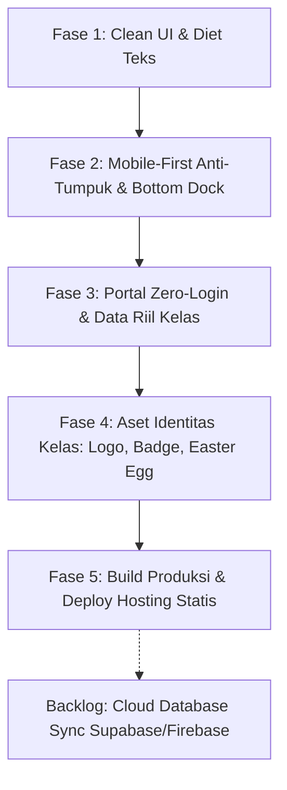

# 🚀 Future Plan & Roadmap Terfokus — ClassHub

Dokumen ini merangkum **rencana pengembangan terarah**, hasil analisis survei pengguna terkait **konsep Clean UI & pemangkasan teks berlebih**, serta **desain mendalam untuk sistem login siswa dan fitur-fitur masa depan** pada aplikasi PWA ClassHub.

---

## 📊 1. Status Audit Proyek Terkini (Capaian v2.0)

Berikut adalah status modul dan fitur yang telah berhasil diimplementasikan pada proyek saat ini:

| Fitur / Modul | Status | Keterangan |
| :--- | :---: | :--- |
| **PWA (Progressive Web App)** | ✅ **Selesai** | Dikonfigurasi via `vite-plugin-pwa`, manifest offline, service worker, & prompt install di HP (`InstallBanner.jsx`). |
| **Generator Pesan WhatsApp (Smart Share)** | ✅ **Selesai** | Modal generator pesan WA (Daily Briefing, Weekly Digest, Kas) via `WhatsAppShareModal.jsx`. |
| **Live Class Tracker & Countdown** | ✅ **Selesai** | Pelacakan jam pelajaran aktif real-time, waktu sisa, & status jam istirahat (`LiveClassTracker.jsx`). |
| **Akademik & Tracking Tugas Per Siswa** | ✅ **Selesai** | Status Todo / Doing / Done per siswa dengan animasi selebrasi konfeti saat tugas selesai. |
| **Buku Kas & Matriks Iuran** | ✅ **Selesai** | Pembukuan pemasukan/pengeluaran, filter iuran pribadi, & matriks lunas per siswa. |
| **Notion-Style UI & Mobile Nav Dock** | ✅ **Selesai** | Antarmuka bernuansa Notion, typography *Plus Jakarta Sans*, dan dock navigasi bawah untuk HP. |

---

## 🔍 2. Diagnosa Hasil Survei: Mengapa UI Terasa "Terlalu Rame" & Sulit Dipahami?

Berdasarkan survei langsung terhadap pengguna (siswa dan pengurus kelas), terdapat keluhan utama bahwa tampilan antarmuka terasa **penuh sesak (*cluttered*)**, **terlalu banyak teks yang tidak perlu dibaca**, serta **interaksi yang membingungkan**. 

Berikut identifikasi akar masalah (Root Cause Analysis):

```
                               MASALAH UTAMA SURVEY
                                        │
     ┌──────────────────┬───────────────┴───────────────┬──────────────────┐
     ▼                  ▼                               ▼                  ▼
[Over-Explanation] [Visual Noise / Pelangi Tag] [Cognitive Overload] [Ambiguous Flow]
  Banyak teks basa-    Hampir setiap baris ada     Semua info ditumpuk   Checkbox 3-status
  basi & petunjuk      badge warna-warni;          di 1 layar tanpa      membingungkan;
  yang tak perlu.      mata lelah & tanpa fokus.   prioritas hierarki.   tabel padat di HP.
```

### A. Teks Eksplanatori Berlebih (*Over-Explanation & Patronizing Copy*)
- **Instruksi yang Tidak Perlu**: Ada teks seperti *"Klik kotak centang untuk menandai tugas yang sudah kamu selesaikan."* Pengguna modern sudah memahami fungsi kotak centang; instruksi eksplisit seperti ini justru membuang ruang layar ponsel dan menambah beban baca.
- **Teks Paragraf Basa-Basi di Tracker**: Pada komponen pelacak kelas (*Live Tracker*), terdapat teks nasihat panjang seperti:
  > *"Gunakan waktu istirahat untuk makan siang, sholat, dan menyegarkan pikiran."*  
  > *"Siapkan perlengkapan belajar, cek tugas harian, dan pastikan sudah sarapan..."*  
  Siswa membuka portal kelas hanya butuh waktu **1–2 detik** untuk mengetahui: *"Sekarang pelajaran apa? Sisa berapa menit? Di ruang mana?"*. Teks motivasi panjang justru menjadi polusi visual.
- **Deskripsi Subheader Berulang**: Setiap halaman memiliki subjudul panjang di bawah judul utama yang jarang dibaca namun memakan 20% tinggi layar ponsel sebelum konten utama terlihat (*above-the-fold* terhalang).

### B. "Pelangi Tag" & Kebisingan Visual (*Visual Noise*)
- Dalam satu baris tugas atau baris properti, terdapat 3 sampai 4 badge dengan warna kontras berbeda (kuning, hijau, biru, oranye, ungu).
- Saat semua elemen berwarna mencolok, **tidak ada satu pun elemen yang menonjol**. Mata pengguna mengalami kelelahan visual (*visual fatigue*) karena tidak tahu ke mana harus mengarahkan pandangan pertama kali.

### C. Beban Kognitif di Layar Ponsel (*Viewport Crowding*)
- Pada *DashboardView*, pengguna langsung dihujani:
  1. Header halaman + icon + deskripsi panjang
  2. Banner Callout kuning 3 baris
  3. Baris properti status (4 kotak)
  4. Live Class Tracker besar dengan progress bar dan 3 meta item
  5. Daftar tugas harian + tombol WhatsApp + tombol Lihat Semua
  6. Tabel jadwal pelajaran hari ini
  7. Kartu pengumuman kelas terkini
- Ketiadaan ruang kosong (*whitespace*) yang memadai membuat pengguna merasa "terintimidasi" oleh tumpukan kotak dan garis pembatas.

### D. Ambiguitas Interaksi (*Unexpected Mechanics*)
- **Checkbox 3-Status**: Mengklik kotak centang tugas saat ini mengganti status secara berurutan: `todo` → `doing` → `done`. Pengguna terbiasa bahwa **centang = selesai, kosong = belum**. Pola 3 status pada 1 kotak centang membuat siswa bingung apakah tugasnya sudah tuntas atau belum.
- **Matriks Kas Raksasa di HP**: Menampilkan tabel iuran 36 siswa x 12 minggu langsung di layar ponsel yang sempit menimbulkan scroll horizontal ekstrem yang membingungkan.

---

## 🧼 3. Filosofi Desain "Clean UI": High Signal, Zero Fluff

Konsep **Clean UI** bukan sekadar membuat latar belakang menjadi putih kosong atau menghapus fitur, melainkan **meningkatkan Signal-to-Noise Ratio (Rasio Manfaat dibanding Kebisingan)**.

> 📐 **Prinsip Utama**: *"Jika suatu kata, warna, atau garis pembatas tidak membantu siswa mengambil keputusan dalam 3 detik, hilangkan atau sembunyikan."*

```
┌─────────────────────────────────────────────────────────────────────────┐
│                    FRAMEWORK CLEAN UI CLASSHUB                          │
├─────────────────────────────────────────────────────────────────────────┤
│                                                                         │
│  1. ATURAN 3 DETIK (Glanceable UI)                                      │
│     Siswa memahami status belajarnya seketika tanpa perlu membaca teks  │
│     lebih dari 5 kata.                                                  │
│                                                                         │
│  2. DIET TEKS EKSTREM (Zero Instructional Copy)                         │
│     Hapus semua kalimat panduan cara klik/pilih. Biarkan bentuk UI      │
│     (affordance) yang menjelaskan fungsinya sendiri.                    │
│                                                                         │
│  3. PROGRESSIVE DISCLOSURE (Ketahui Saat Butuh)                         │
│     Tampilkan hanya intinya di halaman utama (Judul & Deadline).        │
│     Detail panjang, link Drive, dan catatan guru masuk ke modal/drawer. │
│                                                                         │
│  4. MONOCHROMATIC RESTRAINT (Disiplin Warna)                            │
│     Gunakan palet netral (slate/gray). Warna cerah HANYA untuk kondisi  │
│     kritis: Merah (Deadline <24 Jam/Tunggakan), Hijau (Tuntas).         │
│                                                                         │
│  5. PERSONAL-FIRST VIEW (Utamakan Data Diri Siswa)                      │
│     Tampilkan "Tugas Saya" dan "Kas Saya" terlebih dahulu, bukan data   │
│     seluruh siswa kelas secara bertumpuk.                               │
│                                                                         │
└─────────────────────────────────────────────────────────────────────────┘
```

---

## 🎨 4. Rencana Perombakan UI per Halaman (Before vs. After)

### 4.1. Dashboard Utama (`DashboardView.jsx`)

| Komponen | Kondisi Sekarang (Rame & Berisik) | Solusi Clean UI Baru (Fokus & Bernapas) |
| :--- | :--- | :--- |
| **Greeting & Callout** | Paragraf panjang 3 baris: *"Selamat Pagi, Fauzan! Kamu memiliki 2 tugas yang belum selesai. Semangat belajarnya! Hari ini giliranmu piket..."* | **1 Baris Ringkas & Personal**: *"Halo, Fauzan 👋 • 2 tugas menanti • Piket hari ini"* |
| **Live Class Tracker** | Box besar dengan teks motivasi, 4 badge status, countdown detik, dan teks paragraf istirahat. | **Compact Hero Widget**: <br>• Label kecil: `"SEKARANG (08:30 - 10:00)"`<br>• Judul Besar: **Pemrograman Web**<br>• Subteks 1 baris: `Pak Budi • Lab Komputer 2 • Sisa 25 mnt`<br>• *Tanpa teks ceramah istirahat/weekend!* |
| **Daftar Tugas** | Ada teks penjelasan cara centang tugas, tombol WA, tombol Lihat Semua, badge abu-abu, tanggal tenggat panjang. | **Micro-Focus To-Do (Maks 3 item terdekat)**:<br>• Checkbox binary sederhana.<br>• Judul tugas + badge tenggat merah jika mendesak (`Besok, 23:59`).<br>• Link *"Lihat semua (5) →"* di bagian bawah. |
| **Jadwal Hari Ini** | Menampilkan tabel/kartu seluruh pelajaran hari ini yang memakan tempat. | Disatukan ke dalam tab ringkas atau hanya menampilkan **Pelajaran Berikutnya** (*Next Up*), bukan seluruh daftar jika sudah siang hari. |

---

### 4.2. Akademik & Tugas (`AcademicView.jsx`)

| Masalah UI Lama | Solusi Desain Baru |
| :--- | :--- |
| **Checkbox 3-Status** (`todo` → `doing` → `done`) membuat siswa ragu apakah tugas sudah selesai. | **Kembali ke Checkbox Standar (Binary)**: <br>• Klik 1x = Langsung Selesai (Coret & Hijau).<br>• Klik lagi = Batal Selesai.<br>• Opsi *"Sedang Dikerjakan"* hanya berupa filter tab terpisah untuk siswa yang membutuhkan, bukan tombol klik berulang. |
| **Deskripsi & Link Mengotori List**: Kartu tugas memuat teks deskripsi panjang dan tombol link yang membuat ukuran kartu tidak seragam. | **Accordion / Tap-to-Expand**: Kartu hanya menampilkan judul, mapel, dan deadline. Jika diketuk, kartu membuka deskripsi dan tautan pengumpulan secara mulus. |
| **Sub-Tab Berjejer Padat**: Tab *"Daftar Tugas"* dan *"Jadwal Ujian"* ditambah filter status dan filter mapel yang berantakan di layar HP. | **Pill Filter Horizontal Bersih**: Filter status disederhanakan menjadi 3 tombol chip minimalis: `Semua`, `Perlu Dikerjakan`, `Selesai`. |

---

### 4.3. Kas & Keuangan (`CashView.jsx`)

| Masalah UI Lama | Solusi Desain Baru |
| :--- | :--- |
| **Matriks Raksasa di Ponsel**: Siswa langsung disodori tabel spreadsheet puluhan nama dan kotak iuran yang sulit digeser di HP. | **Prinsip "Personal First"**: <br>1. **Kartu Status Saya (Paling Atas)**: Kotak bersih berukuran pas: `Status Iuran Anda: LUNAS s/d Pekan 12` atau `Tunggakan: Rp 20.000 (2 Pekan)`. Lengkap dengan tombol konfirmasi ke bendahara.<br>2. **Tab Kedua "Buku Kas Kelas"**: Rincian arus kas masuk/keluar.<br>3. **Matriks Seluruh Kelas**: Masuk ke sub-tab *"Seluruh Siswa"* dengan pencarian nama instan, bukan tabel telanjang. |
| **Baris Properti Keuangan Terlalu Padat**: Saldo, Pemasukan, Pengeluaran, dan Iuran Wajib berjejer 4 kotak dengan warna kontras. | **Card Ringkasan Finansial Modern**: Saldo utama ditampilkan besar elegan, rincian pemasukan/pengeluaran ditampilkan proporsional di bawahnya tanpa badge warna yang menusuk mata. |

---

### 4.4. Kaidah Reduksi Teks (Microcopy Clean Guidelines)

Daftar kata/kalimat yang **DILARANG** digunakan pada rilis berikutnya demi menjaga antarmuka tetap bersih:

| Teks Lama yang Dihapus | Alasan | Format Pengganti yang Bersih |
| :--- | :--- | :--- |
| *"Klik kotak centang untuk menandai tugas yang sudah kamu selesaikan."* | Menjelaskan hal yang sudah jelas (Redundan). | **Dihapus total**. Tidak perlu teks panduan. |
| *"Daftar tugas terstruktur & jadwal evaluasi ujian kelas"* | Deskripsi formal yang tidak memberi nilai aksi. | **Dihapus total** atau diganti ringkasan dinamis: `3 tugas aktif`. |
| *"Gunakan waktu istirahat untuk makan siang, sholat, dan menyegarkan pikiran."* | Teks basa-basi yang memperpanjang scroll HP. | Cukup status: `Istirahat • Masuk pukul 12:45`. |
| *"Papan warta pengumuman resmi & direktori siswa..."* | Subjudul klise pengisi ruang. | Cukup judul: `Pengumuman Kelas`. |
| *"Klik tombol di bawah ini untuk mengunduh laporan..."* | Gaya penulisan era web lama. | Tombol berlabel jelas: `Unduh Rekap (PDF)`. |

---

## 🔑 5. Arah Akses Portal: Zero-Login & Client-Side Personal Companion (v2.1)

### A. Rasionalisasi Pemangkasan Sistem Login
Pada analisis awal, dirancang sistem login PIN 4-digit dan multi-tier RBAC. Namun, karena aplikasi saat ini beroperasi murni di sisi peramban (*client-side localStorage*) tanpa sinkronisasi cloud database:
1. **Beban Akses Tidak Perlu (*Friction*)**: Memaksa siswa memilih nama dan mengetik PIN setiap kali membuka web hanya untuk melihat jadwal pelajaran menimbulkan hambatan yang tidak perlu.
2. **Ilusi Sinkronisasi**: Jika siswa mengedit tugas atau data di HP-nya, perubahan tersebut tetap tidak akan tersinkron ke HP teman sekelasnya.

### B. Keputusan Desain v2.1: Portal Instan 0-Detik
```
┌────────────────────────────────────────────────────────┐
│             ALUR AKSES ZERO-LOGIN CLASSHUB             │
├────────────────────────────────────────────────────────┤
│                                                        │
│  Siswa Klik Link / Buka Aplikasi PWA di HP             │
│     │                                                  │
│     ▼                                                  │
│  ⚡ LANGSUNG MASUK KE DASHBOARD HARI INI (0 DETIK)     │
│     (Tanpa layar login, tanpa pilih nama, tanpa PIN)   │
│                                                        │
│     │                                                  │
│     ├─► Jadwal Pelajaran Aktif & Sisa Waktu Bel        │
│     ├─► Daftar Tugas & Checklist Personal di HP        │
│     ├─► Petugas Piket Hari Ini                         │
│     └─► Pengumuman Penting Kelas                       │
│                                                        │
└────────────────────────────────────────────────────────┘
```

* **Checklist Tugas Mandiri**: Siswa tetap dapat mencentang tugas yang sudah selesai (`todo` ↔ `done`). Status centang ini tersimpan secara lokal dan aman di `localStorage` ponsel masing-masing sebagai asisten belajar pribadi.
* **Mode Pengurus Terlindungi**: Fitur penambahan/pengeditan data utama kelas hanya dapat diakses melalui PIN darurat pengurus atau dikelola langsung pada berkas sumber sebelum dilakukan build produksi.
* **Catatan Masa Depan**: Sistem autentikasi akun multi-tier dan hak akses per jabatan disimpan di backlog saat integrasi database cloud (Supabase/Firebase) diterapkan.

---

## 📑 6. Fitur Pendukung: Ekspor Laporan Kas Resmi (PDF & Cetak)

Kebutuhan bagi Bendahara Kelas untuk mencetak laporan pertanggungjawaban kas:
- **Format Cetak Standar Kertas A4**: Kop surat resmi sekolah/kelas, ringkasan saldo, rincian pengeluaran, dan matriks pembayaran siswa.
- **Kolom Tanda Tangan Resmi**: Kolom tanda tangan Ketua Kelas, Bendahara, dan Wali Kelas.
- **Pilihan Ekspor**: Tombol *"Cetak / Simpan PDF"* via `@media print` dan unduhan format CSV/Excel.

---

## 📡 7. Pusat Broadcast Hub (WhatsApp & Webhook Discord)

Kebutuhan pengurus untuk menyiarkan informasi kelas secara terpusat:
1. **WhatsApp Broadcast Center**:
   - **Template Builder**: Generator teks dinamis berbasis tanggal (`{hari_ini}`, `{tugas_mendesak}`, `{jadwal_besok}`, `{piket_besok}`).
   - **Pratinjau Monospace**: Pratinjau format WhatsApp sebelum dikirim.
   - **Aksi 1-Klik**: Tombol *"Buka WhatsApp"* (`wa.me/?text=...`) dan *"Salin Teks"*.
2. **Integrasi Webhook Discord**:
   - Pengiriman Rich Embed otomatis ke channel Discord kelas untuk reminder tugas mendesak.

---

## 📱 8. Arsitektur Antarmuka Ponsel: Anti-Tumpuk & Mobile-First UX

Untuk menjamin tampilan di layar smartphone terlihat rapi, modern, dan **bebas dari elemen yang saling bertumpuk atau terpotong**:

```
                ARSITEKTUR LAYOUT MOBILE CLASSHUB (ANTI-TUMPUK)
┌─────────────────────────────────────────────────────────────────────────┐
│  [ClassHub] Portal Kelas                         🌙 Mode    (KLS)       │ <-- Top Bar Ramping
├─────────────────────────────────────────────────────────────────────────┤
│                                                                         │
│  ┌───────────────────────────────────────────────────────────────────┐  │
│  │ ⚡ CARD 1: HERO TRACKER                                            │  │
│  │ Pemrograman Web • Lab Komputer 2 (Sisa 25 Menit)                  │  │
│  └───────────────────────────────────────────────────────────────────┘  │
│                                                                         │
│  ┌─────────────────────────────────┐ ┌───────────────────────────────┐  │
│  │ 📝 CARD 2: TUGAS HARI INI       │ │ 🧹 CARD 3: PIKET HARI INI     │  │ <-- Bento Grid 2 Kolom
│  │ 2 Tugas Belum Selesai           │ │ Dimas, Eka, Fikri             │  │
│  └─────────────────────────────────┘ └───────────────────────────────┘  │
│                                                                         │
│  ┌───────────────────────────────────────────────────────────────────┐  │
│  │ 📢 CARD 4: PENGUMUMAN TERBARU                                     │  │
│  └───────────────────────────────────────────────────────────────────┘  │
│                                                                         │
├─────────────────────────────────────────────────────────────────────────┤
│      🌟               📅                  📝               👥           │ <-- Bottom Dock Bar
│   Hari Ini          Jadwal              Tugas            Kelas          │     (Ramah Jempol)
└─────────────────────────────────────────────────────────────────────────┘
```

### A. Pilar Perbaikan Desain Ponsel:

1. **Pemisahan Navigasi: Top Bar Ramping & Bottom Navigation Dock**:
   - **Top Bar Atas**: Hanya memuat identitas kelas (`Logo ClassHub`) di kiri, serta toggle tema dan info kelas di kanan. Seluruh tombol tab halaman dibersihkan dari atas!
   - **Bottom Navigation Dock**: 4 navigasi utama (Hari Ini, Jadwal, Tugas, Kelas) dipindahkan ke bar bawah layar yang menempel (*fixed bottom dock*). Mudah dijangkau satu tangan dengan jempol, serta ramah gesture bar iPhone (`safe-area-inset-bottom`).

2. **Hierarki Bento Grid di Dashboard (Mencegah Efek Tumpukan Balok)**:
   - Alih-alih menumpuk 7 kotak panjang dari atas ke bawah, digunakan tata letak modular:
     - **Hero Widget (Atas)**: *Live Class Tracker* kompak (hanya nama mapel, sisa menit, dan progress bar tipis tanpa teks motivasi panjang).
     - **2-Column Quick Glance**: Kotak kecil berdampingan di HP untuk *Tugas Mendesak* dan *Piket Hari Ini*.
     - **Spacing Bernapas**: Jarak antar komponen teratur (`gap: 0.85rem - 1rem`) dengan padding luar yang pas di layar HP.

3. **Transformasi Tabel Menjadi List Card di Layar Kecil**:
   - Tabel lebar desktop (seperti jadwal mingguan atau daftar iuran) otomatis berganti menjadi **Kartu Vertikal Minimalis** pada layar ponsel (`< 640px`).
   - Halaman utama dikunci dengan `max-width: 100%; overflow-x: hidden;` sehingga **100% bebas dari bug geser samping (*zero horizontal scroll*)**.

4. **Standar Ukuran Sentuh Jempol (*Touch Targets Min 44px*)**:
   - Seluruh elemen yang dapat diklik (checkbox tugas, tombol navigasi, filter) memiliki area sentuh minimal **44px × 44px** dengan jarak aman antar tombol untuk mencegah salah tekan.

5. **Disiplin Warna (Menghilangkan Kebisingan Visual / Pelangi Tag)**:
   - Menghindari penggunaan 4-5 warna mencolok dalam satu layar.
   - Warna cerah hanya digunakan untuk status penting: **Merah** untuk deadline hari ini, **Hijau** untuk tugas tuntas. Sisanya menggunakan palet netral yang nyaman di mata.

---

## ⏳ 9. Fitur yang Ditunda & Dibatalkan

### A. Fitur yang Ditunda (*Backlog*)
- **Cloud Database Sync (Supabase/Firebase)**: Ditunda hingga data kas dan jadwal resmi semester ini difinalisasi pengurus kelas. Saat ini `localStorage` sudah mencukupi dan sangat responsif.
- **Bot Pengingat Telegram Otomatis**: Ditunda; difokuskan terlebih dahulu pada Discord Webhook & WhatsApp generator di Broadcast Hub.

### B. Fitur yang Dibatalkan (*Cancelled demi Clean UI & Fokus*)
Agar antarmuka tetap bersih dan tidak bengkak (*bloatware*), fitur-fitur berikut **resmi dibatalkan**:
- 🔄 **Mode Portal Read-Only (Zero-Login)**: *Diadopsi sebagai Strategi Peluncuran Utama (v2.1)* menggantikan sistem login rumit. Karena aplikasi belum memiliki backend/database cloud (client-side `localStorage`), alur login dihilangkan agar siswa langsung masuk ke dashboard dalam 1 detik tanpa hambatan.
- ❌ **Portofolio Karya & Snippet Hub**: Dibatalkan agar portal tetap fokus sebagai alat utilitas kelas.
- ❌ **Lo-Fi Player, Soundboard & Mini-Games**: Dibatalkan untuk menghemat kuota internet dan menjaga performa ringan.
- ❌ **Buku Kenangan & Polling Kilat**: Dibatalkan karena polling lebih efektif dilakukan di grup WhatsApp.

---

## 🗓️ 10. Roadmap Pelaksanaan Terintegrasi



### 📋 Tabel Rencana Eksekusi

| Tahap | Fokus Utama | Rincian Pekerjaan | Estimasi | Prioritas |
| :--- | :--- | :--- | :---: | :---: |
| **Fase 1** | **Clean UI & Diet Teks (Selesai)** | • Pemangkasan seluruh teks instruksi redundan & teks motivasi di Live Tracker.<br>• Redesain Dashboard menjadi fokus bento (Glanceable UI).<br>• Kembalikan checkbox tugas ke binary (centang = tuntas).<br>• Kartu anggota bersih (tanpa piket/birokrasi).<br>• Hapus judul ganda per halaman & bersihkan halaman login. | Selesai | 🟢 **Tuntas** |
| **Fase 2** | **Arsitektur Mobile Anti-Tumpuk & Bottom Dock** | • **Pemisahan Navigasi**: Bersihkan Top Bar dari tab berdesakan; aktifkan Bottom Navigation Dock ramah jembol di HP.<br>• **Perbaikan Bug Geser Samping**: Kunci `max-width: 100%` & `overflow-x: hidden`.<br>• **Bento Card Dashboard**: Tata letak modular 2 kolom (Tugas & Piket) agar tidak menumpuk.<br>• **Transformasi Tabel**: Ubah tabel lebar menjadi kartu vertikal minimalis di ponsel. | 1 Hari | 🔴 **Sangat Tinggi (Mendesak)** |
| **Fase 3** | **Portal Zero-Login & Data Riil Kelas** | • Bypass layar `LoginGate` langsung ke Dashboard (0 detik).<br>• Input data riil: nama siswa asli, jadwal mapel Senin–Jumat, kalibrasi bel KBM, dan regu piket.<br>• Amankan proteksi menu admin pengurus. | 1 Hari | 🔴 **Sangat Tinggi** |
| **Fase 4** | **Aset Identitas Kelas** | • Pasang Logo Resmi Kelas pada Header & Ikon PWA (`public/pwa-*.png`).<br>• Sematkan Ikon/Badge visual pada setiap mata pelajaran.<br>• Pasang Easter Egg Developer di footer dan Secret Tap konfeti pada logo kelas. | 1 Hari | 🟡 **Tinggi** |
| **Fase 5** | **Build Produksi & Hosting Statis** | • Uji coba kompilasi `npm run build` bebas error.<br>• Deploy ke Vercel / Netlify / Cloudflare Pages dengan SSL/HTTPS otomatis.<br>• Uji instalasi PWA di Android dan iOS. | 1 Hari | 🟡 **Tinggi** |
| **Backlog** | **Cloud Database & Multi-User RBAC** | • Integrasi Supabase / Firebase untuk sinkronisasi realtime multi-device jika sudah dibutuhkan di masa depan. | Ditunda | ⚪ *Kebutuhan Lanjutan* |

---

> 🎯 **Komitmen Akhir Desain**:  
> ClassHub berpegang teguh pada prinsip **"Less is More"**. Antarmuka yang hebat bukanlah antarmuka dengan teks terbanyak atau hiasan terlengkap, melainkan antarmuka yang memungkinkan siswa **menemukan informasi dalam 2 detik dan kembali fokus belajar**.

---

## 💡 11. Brainstorming Ide Fitur Baru & Eksplorasi Inovasi

Hasil eksplorasi ide dan inovasi masa depan untuk memperkuat utilitas ClassHub tanpa mengorbankan filosofi **Clean UI & High-Signal**:

```
                              ┌───────────────────────────────────┐
                              │     CLASSHUB FUTURE INNOVATIONS   │
                              └─────────────────┬─────────────────┘
                                                │
         ┌───────────────────┬──────────────────┼───────────────────┬───────────────────┐
         ▼                   ▼                  ▼                   ▼                   ▼
   [1. Smart Auto]     [2. Smart Kas]     [3. Academic Hub]   [4. Micro-Polls]    [5. Admin Tools]
   • WA Cron Bot       • Upload Bukti     • Folder Drive Mapel • Quick Voting      • QR Piket Check-in
   • Push Notif PWA    • Approval 1-Klik  • Buku Nilai Privat  • Urgent Banner     • Ekspor PDF Kop Resmi
   • Live Bell Tracker • Analitik Biaya   • Kisi-Kisi Ujian    • Kotak Aspirasi    • Hak Akses Spesifik
```

---

### 1️⃣ Otomasi Cerdas & Pengingat Mandiri (Smart Class Automation)

*Tujuan: Menghilangkan keharusan admin membuka web dan mengetik manual setiap malam.*

* **🤖 Automated WhatsApp Brief Scheduler (Serverless Cron Bot)**
  * **Ide**: Alih-alih pengurus harus membuka dashboard admin dan menekan tombol *Share to WhatsApp* setiap malam, sistem menjalankan scheduler (via serverless cron/webhook pihak ketiga seperti Fonnte/Waha/Baileys) otomatis pada pukul **19:00 WIB**.
  * **Output**: Pesan WhatsApp Brief otomatis terkirim langsung ke grup kelas berisi jadwal besok, tugas deadline, dan petugas piket.
  * **Nilai Tambah**: 100% *zero manual effort* bagi pengurus kelas setelah jadwal diinput satu kali.

* **🔔 PWA Web Push Notifications (Pengingat Deadline & Piket Personal)**
  * **Ide**: Menggunakan Service Worker PWA modern untuk mengirimkan notifikasi lokal ke smartphone masing-masing siswa:
    * **H-1 Deadline Tugas**: *"Tugas Matematika belum dicentang selesai, deadline besok!"*
    * **Pagi Hari Piket (Pukul 06:00 WIB)**: *"Hari ini giliran piketmu! Datang lebih awal ya."*
  * **Nilai Tambah**: Siswa tidak perlu terus membuka web untuk mengetahui tanggung jawab mendesak mereka.

* **⏰ Dynamic Classroom State Tracker (Indikator Jam Pelajaran Berjalan)**
  * **Ide**: Kotak status dinamis real-time di bagian atas dashboard:
    * Menampilkan: *"Sedang berlangsung: Pemrograman Web (Jam ke-3 s.d 4, sisa 25 menit)"*
    * Saat istirahat: *"Waktu Istirahat (s.d 10:15 WIB)"*
  * **Nilai Tambah**: Sangat berguna saat HP siswa diletakkan di meja atau ditampilkan di layar monitor proyektor kelas.

---

### 2️⃣ Fintech & Transparansi Kas Digital (Class Cash Management)

*Tujuan: Mempermudah kerja bendahara dan mencegah selisih/hilang catatan uang kas.*

* **📸 Upload Bukti Bayar / QRIS Kas Mandiri**
  * **Ide**: Siswa dapat membayar kas via QRIS/Transfer bank, lalu mengunggah screenshot struk pembayaran langsung dari profil siswa mereka di ClassHub.
  * **Alur Bendahara**: Di dashboard bendahara muncul daftar *"Menunggu Verifikasi"*. Bendahara cukup melihat bukti gambar dan menekan tombol **[Terima]** atau **[Tolak]**. Jika diterima, status kas siswa langsung tercentang lunas.
  * **Nilai Tambah**: Menghilangkan drama "Saya sudah bayar tapi kok belum dicatat" di grup kelas.

* **📊 Analitik Pengeluaran Kas Interaktif**
  * **Ide**: Visualisasi ringkas diagram lingkaran/batang kategori pengeluaran kas kelas:
    * Kategori: *Operasional/Fotokopi*, *Alat Kebersihan*, *Konsumsi/Sosial*, *Sisa Saldo Kas*.
  * **Nilai Tambah**: Transparansi total kepada seluruh siswa dan wali murid tanpa perlu ditanya saat rapat kelas.

* **🧮 Kalkulator Iuran Patungan Kegiatan (Split Bill Class Project)**
  * **Ide**: Fitur kalkulator sederhana saat kelas ingin mengadakan kegiatan bersama (misal: acara bukber, perpisahan, beli kado wali kelas, atau kas tambahan lomba).
  * **Cara Kerja**: Masukkan total target biaya $\rightarrow$ sistem otomatis membagi rata per jumlah siswa yang ikut dan melacak siapa saja yang sudah menyetor.

---

### 3️⃣ Academic Hub & Sentralisasi Materi (Academic Utility)

*Tujuan: Memangkas waktu mencari link materi dan membantu evaluasi nilai mandiri.*

* **📁 Pintasan Folder Google Drive per Mata Pelajaran**
  * **Ide**: Mengintegrasikan 1 tautan Google Drive / Google Classroom di setiap kartu mata pelajaran pada jadwal mingguan atau halaman akademik.
  * **Nilai Tambah**: Tidak ada lagi siswa yang menanyakan *"Link materi presentasi tadi apa ya?"* di grup WhatsApp. Semua arsip kelas tersentralisasi rapi.

* **📈 Buku Catatan Nilai Pribadi (Private Grade Notebook)**
  * **Ide**: Ruang catatan privat yang hanya bisa diakses siswa yang bersangkutan (terproteksi PIN siswa).
  * **Fitur**: Siswa dapat mencatat nilai tugas, ulangan harian, UTS, dan UAS mereka sendiri per mata pelajaran, lengkap dengan estimasi rata-rata nilai semester berjalan.
  * **Privasi**: Tidak dapat dilihat oleh admin maupun siswa lain.

* **📑 Lampiran Kisi-Kisi Ujian Terpadu**
  * **Ide**: Pada modul Ujian Terdekat, admin dapat menyematkan file PDF atau tautan dokumen kisi-kisi ujian resmi dari guru.

---

### 4️⃣ Mikro-Koordinasi & Suara Siswa (Micro-Polls & Class Vibes)

*Tujuan: Mengambil keputusan kelas secara cepat dan demokratis.*

* **🗳️ Polling Cepat Kelas (Anonymous Quick Polls)**
  * **Ide**: Fitur voting kilat yang dibuat oleh pengurus untuk menentukan keputusan bersama, misalnya:
    * *"Pilih desain hoodie kelas: Opsi A vs Opsi B"*
    * *"Waktu pengganti jam tambahan: Kamis sore atau Sabtu pagi?"*
  * **Cara Kerja**: 1 siswa = 1 suara (terverifikasi via akun PIN). Hasil langsung keluar dalam diagram batang interaktif secara real-time.
  * **Nilai Tambah**: Menghindari perdebatan panjang dan tenggelamnya vote di chat grup WhatsApp.

* **🚨 Banner Pengumuman Darurat (Urgent Classroom Announcement)**
  * **Ide**: Kartu peringatan tingkat tinggi di bagian paling atas dashboard jika ada situasi mendadak:
    * Contoh: *"Perhatian: Hari ini jam ke-3 Guru berhalangan hadir. Seluruh siswa mengerjakan modul halaman 42 di perpustakaan."*
  * **Kontrol**: Dilengkapi tombol timer otomatis agar banner menghilang sendiri setelah jam pelajaran terkait selesai.

* **📬 Kotak Aspirasi & Keluhan Anonim (Private Feedback Box)**
  * **Ide**: Form aspirasi terbuka bagi siswa untuk menyampaikan kendala suasana belajar, fasilitas kelas yang rusak (spidol habis, AC mati), atau usulan ke Wali Kelas tanpa rasa sungkan.

---

### 5️⃣ Superpowers Pengurus Kelas (Official Administration Tools)

*Tujuan: Menjadikan ClassHub alat bantu administrasi resmi yang siap diaudit sekolah.*

* **🖨️ Generator Laporan Kas Formal A4 (Siap Cetak)**
  * **Ide**: Tombol 1-klik untuk mengonversi seluruh mutasi kas kelas menjadi dokumen PDF A4 ber-kop surat resmi sekolah, tabel mutasi rapi, serta slot tanda tangan fisik:
    * *Mengetahui: Wali Kelas*
    * *Disetujui: Ketua Kelas*
    * *Dibuat Oleh: Bendahara Kelas*
  * **Nilai Tambah**: Mempermudah laporan pertanggungjawaban bulanan ke wali murid atau pihak kesiswaan sekolah.

* **📱 Check-in Piket Berbasis QR Code**
  * **Ide**: Di pagi hari, seksi kebersihan dapat menampilkan QR Code dinamis di meja kelas. Petugas piket hari itu cukup memindai QR code dari HP mereka untuk konfirmasi bahwa mereka sudah hadir dan menjalankan piket.
  * **Nilai Tambah**: Menghilangkan perdebatan siapa yang benar-benar piket dan siapa yang titip nama.

* **🛡️ Delegasi Akses Pengurus (Role-Based Micro Permissions)**
  * **Ide**: Alih-alih satu password admin tunggal yang dipakai bersama-sama:
    * **Bendahara**: Hanya dapat mengubah & memvalidasi data Kas.
    * **Seksi Kebersihan**: Hanya dapat mengelola Jadwal & Konfirmasi Piket.
    * **Sekretaris**: Hanya dapat menambah Jadwal Pelajaran, Tugas, & Ujian.
    * **Ketua Kelas**: Akses penuh ke seluruh modul.

---

### ⚖️ Matriks Prioritas: Dampak vs. Kompleksitas Implementasi

| Fitur | Kategori | Kompleksitas Teknis | Dampak Nilai Siswa/Kelas | Rekomendasi Tahap |
| :--- | :--- | :---: | :---: | :---: |
| **Pintasan Folder Drive per Mapel** | Akademik | 🟢 Sangat Rendah | 🟡 Tinggi | **Fase Cepat (Next)** |
| **Banner Pengumuman Darurat** | Dashboard | 🟢 Rendah | 🟡 Tinggi | **Fase Cepat (Next)** |
| **Ekspor Laporan Kas PDF Resmi A4** | Keuangan | 🟡 Sedang | 🟢 Sangat Tinggi | **Fase 4 (Roadmap)** |
| **Polling Cepat Kelas (Quick Polls)** | Koordinasi | 🟡 Sedang | 🟢 Sangat Tinggi | **Fase Eksplorasi** |
| **Upload Bukti Transfer Kas Mandiri** | Keuangan | 🟡 Sedang | 🟢 Sangat Tinggi | **Fase Eksplorasi** |
| **Buku Catatan Nilai Pribadi** | Akademik | 🟡 Sedang | 🟡 Tinggi | **Fase Eksplorasi** |
| **PWA Web Push Notification** | Otomasi | 🔴 Tinggi | 🟢 Sangat Tinggi | **Fase Lanjutan** |
| **Automated WhatsApp Cron Bot** | Otomasi | 🔴 Tinggi (Serverless) | 🟢 Sangat Tinggi | **Fase Lanjutan** |
| **QR Code Check-in Piket** | Administrasi | 🔴 Tinggi | ⚪ Sedang | **Backlog Opsional** |

---


## 🏁 12. Strategi Arsitektur Read-Only, Hosting Statis, & Checklist Pra-Peluncuran (Go-Live)

### 12.1 Rasionalisasi Transisi ke Model Portal Read-Only (Zero-Login)

Berdasarkan audit arsitektur sistem, ClassHub saat ini beroperasi murni di sisi peramban (*client-side*) menggunakan `localStorage` tanpa server database terpusat:

```
                            KONDISI ARSITEKTUR SAAT INI
         ┌──────────────────────────────────────────────────────────────┐
         │                    Client Browser (HP Siswa)                 │
         │  ┌───────────────┐     ┌──────────────┐     ┌─────────────┐  │
         │  │ React UI (SPA)│ ──> │ StoreContext │ ──> │localStorage │  │
         │  └───────────────┘     └──────────────┘     └─────────────┘  │
         └──────────────────────────────────────────────────────────────┘
                                         ▲
                                 (TIDAK TERKONEKSI)
                                         ▼
         ┌──────────────────────────────────────────────────────────────┐
         │              Cloud Database / Server (Belum Ada)             │
         └──────────────────────────────────────────────────────────────┘
```

* **Akar Masalah Jika Memaksakan Fitur Login/Edit Multi-User**:
  1. Perubahan data (tambah tugas, bayar kas, edit jadwal) yang dilakukan di HP Siswa A **tidak akan pernah muncul** di HP Siswa B karena data terisolasi di memori lokal masing-masing perangkat.
  2. Siswa merasa terbebani (*high friction*) harus memilih nama dan mengetikkan PIN 4-digit hanya untuk mengecek jadwal pelajaran berikutnya.

* **Solusi Strategis (v2.1 Read-Only Companion)**:
  1. **Bypass Login**: Siswa yang membuka link/PWA langsung mendarat di **Dashboard Hari Ini** dalam tempo 1 detik (*instant access*).
  2. **Data Bersumber Tunggal (*Single Source of Truth*)**: Jadwal, tugas, pengumuman, dan piket diinput oleh pengurus/developer ke dalam data aplikasi sebelum di-deploy, sehingga seluruh siswa melihat data yang 100% identik dan valid.
  3. **Checklist Tugas Tetap Interaktif Mandiri**: Siswa tetap dapat mencentang tugas yang sudah mereka kerjakan; status centang tersimpan secara aman di `localStorage` HP masing-masing sebagai asisten belajar pribadi.

---

### 12.2 Evaluasi & Pilihan Hosting Statis (Jamstack)

Karena aplikasi telah menjadi *pure static single-page application*, hasil kompilasi `npm run build` (folder `dist/`) siap di-host di penyedia hosting modern tanpa biaya:

| Penyedia Hosting | Keunggulan Utama | Metode Deploy | Cocok Untuk |
| :--- | :--- | :--- | :--- |
| **Vercel** *(Rekomendasi Utama)* | • Deteksi otomatis Vite & React.<br>• Auto-deploy setiap `git push` ke GitHub.<br>• SSL/HTTPS gratis & instan (wajib untuk PWA). | Push ke Repositori GitHub | Alur kerja profesional terintegrasi Git. |
| **Cloudflare Pages** | • Bandwidth tanpa batas (*unlimited*).<br>• Latensi CDN paling kencang di Indonesia.<br>• Perlindungan keamanan tingkat tinggi. | Push ke GitHub / GitLab | Jaminan web selalu instan saat diakses di jaringan seluler siswa. |
| **Netlify** | • Memiliki fitur **Netlify Drop** (upload folder `dist/` secara manual tanpa Git).<br>• Setup subdomain gratis (`namakelas.netlify.app`). | Drag-and-Drop folder `dist` **atau** GitHub | Tim pengurus yang ingin rilis instan tanpa setup Git/CLI. |
| **GitHub Pages** | • Terpasang langsung di ekosistem GitHub tanpa akun ketiga. | GitHub Actions Workflow | Pengelolaan terpusat dalam satu akun GitHub. |

---

### 12.3 Action Checklist Kesiapan Sebelum Digunakan Nyata (*Pre-Launch Checklist*)

Berikut adalah daftar pekerjaan mutlak sebelum web dibagikan ke seluruh anggota kelas:

#### A. Penyesuaian Alur Akses (Bypass Login & Proteksi Kontrol)
- [x] Nonaktifkan / lewati layar `LoginGate.jsx` secara default agar pengunjung langsung membuka `DashboardView.jsx` (Selesai).
- [x] Sembunyikan atau amankan tombol tambah tugas/transaksi dari siswa umum agar tidak membingungkan ekspektasi sinkronisasi (Selesai).
- [x] Pastikan centang tugas personal di dashboard siswa tetap tersimpan rapi di HP masing-masing (Selesai).

#### B. Penggantian Data Dummy ke Data Riil Kelas (`StoreContext.jsx`)
- [ ] **Identitas Kelas**: Perbarui nama kelas resmi, nama sekolah, tahun ajaran, dan nama Wali Kelas.
- [ ] **Daftar Siswa Asli (`members`)**: Masukkan seluruh nama siswa dan nomor absen yang sesuai dengan absensi sekolah.
- [ ] **Jadwal Pelajaran Riil (`schedules`)**: Input mata pelajaran hari Senin s.d. Jumat lengkap dengan nama guru dan ruang lab/kelas.
- [ ] **Kalibrasi Bel KBM (`LiveClassTracker.jsx`)**: Sesuaikan jam pelajaran aktif, durasi per JP (menit), dan jam istirahat agar hitung mundur sisa waktu KBM 100% akurat dengan bel fisik sekolah.
- [ ] **Jadwal Piket Kebersihan**: Pasang regu piket harian yang aktif semester ini.

#### C. Konfigurasi Branding & Standar PWA
- [ ] Sesuaikan nama aplikasi dan deskripsi pada `vite.config.js` (parameter `name` & `short_name`).
- [ ] Pastikan ikon PWA (`pwa-192x192.png`, `pwa-512x512.png`, `maskable-icon-512x512.png`) memakai logo kelas asli agar tampil tajam dan membanggakan di layar utama HP siswa (*Add to Home Screen*).
- [ ] Periksa meta tag judul pada `index.html`.

#### D. Aset Identitas Kelas & Visual
- [ ] **Logo Kelas**: Desain lambang kelas unik untuk header web dan app icon PWA.
- [ ] **Ikon / Badge Mata Pelajaran**: Sematkan ikon/badge visual pada kartu jadwal dan Live Tracker (Web, Basis Data, Game, Mobile, Umum).
- [ ] **Easter Egg Programmer**: Pasang pesan santai di footer dan fitur klik rahasia (*secret tap*) pada logo kelas.

#### E. Pengujian Akhir & Peluncuran
- [ ] Jalankan uji coba lokal di ponsel melalui jaringan WiFi yang sama (`npm run dev -- --host`).
- [ ] Jalankan uji build produksi bebas kesalahan:
  ```bash
  npm run build
  ```
- [ ] Hubungkan ke platform hosting pilihan (Vercel / Netlify) dan dapatkan tautan HTTPS publik.
- [ ] Bagikan tautan ke grup WhatsApp kelas dan uji instalasi PWA di perangkat perwakilan siswa (Android & iOS).

---

### 12.4 Spesifikasi Desain Aset Identitas Kelas
 
Agar web ini terasa memiliki jiwa dan merupakan karya kebanggaan siswa, berikut adalah panduan detail aset visual dan sentuhan interaktif yang direncanakan:

```
                            IDENTITAS VISUAL KELAS
                                         │
        ┌────────────────────────────────┼────────────────────────────────┐
        ▼                                ▼                                ▼
  [1. Logo & App Icon]         [2. Badge Mata Pelajaran]         [3. Easter Eggs]
  • Monogram "ClassHub"        • Web: Tag `< / >` / React        • Footer: Dev Status
  • Simbol Code & Terminal     • Basis Data: Silinder SQL        • Logo Secret Tap (5x)
  • App Icon PWA Homescreen    • Mobile / Game: Phone & Gamepad  • 8-Bit Audio Checklist
```

#### 1. Logo & App Icon PWA Resmi Kelas
* **Konsep Desain**:
  * Menggabungkan inisial kelas dengan aksen khas modern (seperti kurung kurawal `{ }`, tag `< / >`, kursor terminal `_`, atau estetika clean).
  * Palet warna serasi dengan tema web: *Deep Indigo / Royal Blue* dipadukan dengan aksen *Emerald Green / Neon Cyan*.
* **Penerapan Aset**:
  * **Header Web**: Logo SVG vektor tajam di sudut kiri atas navigasi.
  * **PWA App Icon (`public/pwa-*.png`)**: Ikon persegi membulat (*squircle*) yang tampak profesional di homescreen Android dan iOS.

#### 2. Ikon & Badge Pengenal Mata Pelajaran (*Subject Badges*)
Setiap mata pelajaran di jadwal harian dan widget *Live Class Tracker* dilengkapi penanda visual mikro agar siswa dapat mengenali mapel dalam 0.5 detik tanpa membaca teks panjang:

| Kategori Mapel | Contoh Mata Pelajaran | Ikon / Badge Visual | Warna Aksen |
| :--- | :--- | :---: | :--- |
| **Pemrograman Web** | Pemrograman Web & Perangkat Bergerak | `< / >` / `Code2` | Biru / Indigo |
| **Basis Data** | Pengelolaan Basis Data (SQL) | `🗄️` / `Database` | Ungu / Violet |
| **Game Dev** | Pemodelan Perangkat Lunak & Gim | `🎮` / `Gamepad2` | Hijau Neon |
| **Mobile Dev** | Android & Flutter Programming | `📱` / `Smartphone` | Biru Langit |
| **Umum / Bahasa** | B. Indonesia, B. Inggris, Sejarah | `📖` / `BookOpen` | Amber / Oranye |
| **Eksakta** | Matematika Terapan | `📐` / `Binary` | Biru Cyan |
| **Karakter & Agama** | PAI / PPKn / Bimbingan Konseling | `🛡️` / `Sparkles` | Hijau Zamrud |

#### 3. Easter Egg & Sentuhan Mikro Khas Programmer (*Delight Factor*)
* **Footer Status Ala Developer**:
  Di bagian paling bawah halaman ditambahkan status sistem khas anak IT:
  ```
  // Compiled with ☕, React & Vite for ClassHub
  System Status: 0 Errors, 0 Warnings • 100% Bug Free
  ```
* **Secret Tap pada Logo Kelas (Easter Egg Interaktif)**:
  * Jika siswa mengetuk logo kelas di header sebanyak **5 kali berturut-turut**, muncul efek konfeti kejutan beserta notifikasi toast rahasia:
    > *"🚀 Easter Egg Unlocked! Jangan lupa push ke git sebelum tidur."*
* **Sound Effect 8-Bit / Pop Lembut**:
  * Efek audio lembut bernuansa retro game saat siswa mencentang checkbox tugas selesai (*satisfying sound*), memberikan kepuasan instan setelah menyelesaikan PR.

