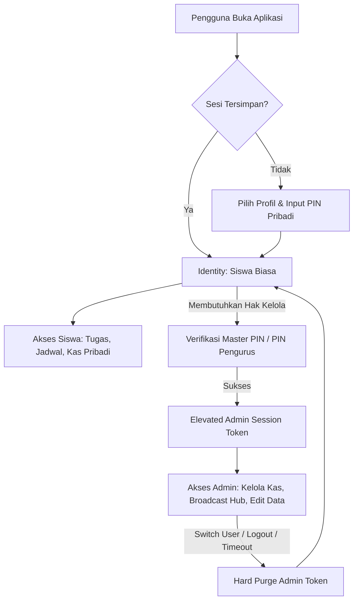
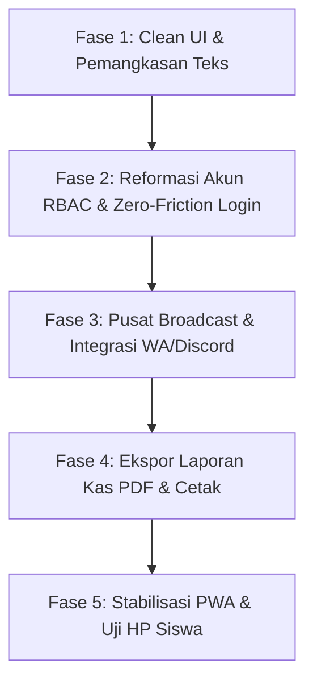

# 🚀 Future Plan & Roadmap Terfokus — ClassHub

Dokumen ini merangkum **rencana pengembangan terarah**, hasil analisis survei pengguna terkait **konsep Clean UI & pemangkasan teks berlebih**, serta **desain mendalam untuk sistem login siswa dan fitur-fitur masa depan** pada aplikasi PWA ClassHub.

---

## 📊 1. Status Audit Proyek Terkini (Capaian v2.0)

Berikut adalah status modul dan fitur yang telah berhasil diimplementasikan pada proyek saat ini:

| Fitur / Modul | Status | Keterangan |
| :--- | :---: | :--- |
| **PWA (Progressive Web App)** | ✅ **Selesai** | Dikonfigurasi via `vite-plugin-pwa`, manifest offline, service worker, & prompt install di HP (`InstallBanner.jsx`). |
| **Generator Pesan WhatsApp (Smart Share)** | ✅ **Selesai** | Modal generator pesan WA (Daily Briefing, Weekly Digest, Kas) via `WhatsAppShareModal.jsx`. |
| **Live Class Tracker & Countdown** | ✅ **Selesai** | Pelacakan jam pelajaran aktif real-time, waktu sisa, & status jam istirahat (`LiveClassTracker.jsx`). |
| **Akademik & Tracking Tugas Per Siswa** | ✅ **Selesai** | Status Todo / Doing / Done per siswa dengan animasi selebrasi konfeti saat tugas selesai. |
| **Buku Kas & Matriks Iuran** | ✅ **Selesai** | Pembukuan pemasukan/pengeluaran, filter iuran pribadi, & matriks lunas per siswa. |
| **Notion-Style UI & Mobile Nav Dock** | ✅ **Selesai** | Antarmuka bernuansa Notion, typography *Plus Jakarta Sans*, dan dock navigasi bawah untuk HP. |

---

## 🔍 2. Diagnosa Hasil Survei: Mengapa UI Terasa "Terlalu Rame" & Sulit Dipahami?

Berdasarkan survei langsung terhadap pengguna (siswa dan pengurus kelas), terdapat keluhan utama bahwa tampilan antarmuka terasa **penuh sesak (*cluttered*)**, **terlalu banyak teks yang tidak perlu dibaca**, serta **interaksi yang membingungkan**. 

Berikut identifikasi akar masalah (Root Cause Analysis):

```
                               MASALAH UTAMA SURVEY
                                        │
     ┌──────────────────┬───────────────┴───────────────┬──────────────────┐
     ▼                  ▼                               ▼                  ▼
[Over-Explanation] [Visual Noise / Pelangi Tag] [Cognitive Overload] [Ambiguous Flow]
  Banyak teks basa-    Hampir setiap baris ada     Semua info ditumpuk   Checkbox 3-status
  basi & petunjuk      badge warna-warni;          di 1 layar tanpa      membingungkan;
  yang tak perlu.      mata lelah & tanpa fokus.   prioritas hierarki.   tabel padat di HP.
```

### A. Teks Eksplanatori Berlebih (*Over-Explanation & Patronizing Copy*)
- **Instruksi yang Tidak Perlu**: Ada teks seperti *"Klik kotak centang untuk menandai tugas yang sudah kamu selesaikan."* Pengguna modern sudah memahami fungsi kotak centang; instruksi eksplisit seperti ini justru membuang ruang layar ponsel dan menambah beban baca.
- **Teks Paragraf Basa-Basi di Tracker**: Pada komponen pelacak kelas (*Live Tracker*), terdapat teks nasihat panjang seperti:
  > *"Gunakan waktu istirahat untuk makan siang, sholat, dan menyegarkan pikiran."*  
  > *"Siapkan perlengkapan belajar, cek tugas harian, dan pastikan sudah sarapan..."*  
  Siswa membuka portal kelas hanya butuh waktu **1–2 detik** untuk mengetahui: *"Sekarang pelajaran apa? Sisa berapa menit? Di ruang mana?"*. Teks motivasi panjang justru menjadi polusi visual.
- **Deskripsi Subheader Berulang**: Setiap halaman memiliki subjudul panjang di bawah judul utama yang jarang dibaca namun memakan 20% tinggi layar ponsel sebelum konten utama terlihat (*above-the-fold* terhalang).

### B. "Pelangi Tag" & Kebisingan Visual (*Visual Noise*)
- Dalam satu baris tugas atau baris properti, terdapat 3 sampai 4 badge dengan warna kontras berbeda (kuning, hijau, biru, oranye, ungu).
- Saat semua elemen berwarna mencolok, **tidak ada satu pun elemen yang menonjol**. Mata pengguna mengalami kelelahan visual (*visual fatigue*) karena tidak tahu ke mana harus mengarahkan pandangan pertama kali.

### C. Beban Kognitif di Layar Ponsel (*Viewport Crowding*)
- Pada *DashboardView*, pengguna langsung dihujani:
  1. Header halaman + icon + deskripsi panjang
  2. Banner Callout kuning 3 baris
  3. Baris properti status (4 kotak)
  4. Live Class Tracker besar dengan progress bar dan 3 meta item
  5. Daftar tugas harian + tombol WhatsApp + tombol Lihat Semua
  6. Tabel jadwal pelajaran hari ini
  7. Kartu pengumuman kelas terkini
- Ketiadaan ruang kosong (*whitespace*) yang memadai membuat pengguna merasa "terintimidasi" oleh tumpukan kotak dan garis pembatas.

### D. Ambiguitas Interaksi (*Unexpected Mechanics*)
- **Checkbox 3-Status**: Mengklik kotak centang tugas saat ini mengganti status secara berurutan: `todo` → `doing` → `done`. Pengguna terbiasa bahwa **centang = selesai, kosong = belum**. Pola 3 status pada 1 kotak centang membuat siswa bingung apakah tugasnya sudah tuntas atau belum.
- **Matriks Kas Raksasa di HP**: Menampilkan tabel iuran 36 siswa x 12 minggu langsung di layar ponsel yang sempit menimbulkan scroll horizontal ekstrem yang membingungkan.

---

## 🧼 3. Filosofi Desain "Clean UI": High Signal, Zero Fluff

Konsep **Clean UI** bukan sekadar membuat latar belakang menjadi putih kosong atau menghapus fitur, melainkan **meningkatkan Signal-to-Noise Ratio (Rasio Manfaat dibanding Kebisingan)**.

> 📐 **Prinsip Utama**: *"Jika suatu kata, warna, atau garis pembatas tidak membantu siswa mengambil keputusan dalam 3 detik, hilangkan atau sembunyikan."*

```
┌─────────────────────────────────────────────────────────────────────────┐
│                    FRAMEWORK CLEAN UI CLASSHUB                          │
├─────────────────────────────────────────────────────────────────────────┤
│                                                                         │
│  1. ATURAN 3 DETIK (Glanceable UI)                                      │
│     Siswa memahami status belajarnya seketika tanpa perlu membaca teks  │
│     lebih dari 5 kata.                                                  │
│                                                                         │
│  2. DIET TEKS EKSTREM (Zero Instructional Copy)                         │
│     Hapus semua kalimat panduan cara klik/pilih. Biarkan bentuk UI      │
│     (affordance) yang menjelaskan fungsinya sendiri.                    │
│                                                                         │
│  3. PROGRESSIVE DISCLOSURE (Ketahui Saat Butuh)                         │
│     Tampilkan hanya intinya di halaman utama (Judul & Deadline).        │
│     Detail panjang, link Drive, dan catatan guru masuk ke modal/drawer. │
│                                                                         │
│  4. MONOCHROMATIC RESTRAINT (Disiplin Warna)                            │
│     Gunakan palet netral (slate/gray). Warna cerah HANYA untuk kondisi  │
│     kritis: Merah (Deadline <24 Jam/Tunggakan), Hijau (Tuntas).         │
│                                                                         │
│  5. PERSONAL-FIRST VIEW (Utamakan Data Diri Siswa)                      │
│     Tampilkan "Tugas Saya" dan "Kas Saya" terlebih dahulu, bukan data   │
│     seluruh siswa kelas secara bertumpuk.                               │
│                                                                         │
└─────────────────────────────────────────────────────────────────────────┘
```

---

## 🎨 4. Rencana Perombakan UI per Halaman (Before vs. After)

### 4.1. Dashboard Utama (`DashboardView.jsx`)

| Komponen | Kondisi Sekarang (Rame & Berisik) | Solusi Clean UI Baru (Fokus & Bernapas) |
| :--- | :--- | :--- |
| **Greeting & Callout** | Paragraf panjang 3 baris: *"Selamat Pagi, Fauzan! Kamu memiliki 2 tugas yang belum selesai. Semangat belajarnya! Hari ini giliranmu piket..."* | **1 Baris Ringkas & Personal**: *"Halo, Fauzan 👋 • 2 tugas menanti • Piket hari ini"* |
| **Live Class Tracker** | Box besar dengan teks motivasi, 4 badge status, countdown detik, dan teks paragraf istirahat. | **Compact Hero Widget**: <br>• Label kecil: `"SEKARANG (08:30 - 10:00)"`<br>• Judul Besar: **Pemrograman Web**<br>• Subteks 1 baris: `Pak Budi • Lab Komputer 2 • Sisa 25 mnt`<br>• *Tanpa teks ceramah istirahat/weekend!* |
| **Daftar Tugas** | Ada teks penjelasan cara centang tugas, tombol WA, tombol Lihat Semua, badge abu-abu, tanggal tenggat panjang. | **Micro-Focus To-Do (Maks 3 item terdekat)**:<br>• Checkbox binary sederhana.<br>• Judul tugas + badge tenggat merah jika mendesak (`Besok, 23:59`).<br>• Link *"Lihat semua (5) →"* di bagian bawah. |
| **Jadwal Hari Ini** | Menampilkan tabel/kartu seluruh pelajaran hari ini yang memakan tempat. | Disatukan ke dalam tab ringkas atau hanya menampilkan **Pelajaran Berikutnya** (*Next Up*), bukan seluruh daftar jika sudah siang hari. |

---

### 4.2. Akademik & Tugas (`AcademicView.jsx`)

| Masalah UI Lama | Solusi Desain Baru |
| :--- | :--- |
| **Checkbox 3-Status** (`todo` → `doing` → `done`) membuat siswa ragu apakah tugas sudah selesai. | **Kembali ke Checkbox Standar (Binary)**: <br>• Klik 1x = Langsung Selesai (Coret & Hijau).<br>• Klik lagi = Batal Selesai.<br>• Opsi *"Sedang Dikerjakan"* hanya berupa filter tab terpisah untuk siswa yang membutuhkan, bukan tombol klik berulang. |
| **Deskripsi & Link Mengotori List**: Kartu tugas memuat teks deskripsi panjang dan tombol link yang membuat ukuran kartu tidak seragam. | **Accordion / Tap-to-Expand**: Kartu hanya menampilkan judul, mapel, dan deadline. Jika diketuk, kartu membuka deskripsi dan tautan pengumpulan secara mulus. |
| **Sub-Tab Berjejer Padat**: Tab *"Daftar Tugas"* dan *"Jadwal Ujian"* ditambah filter status dan filter mapel yang berantakan di layar HP. | **Pill Filter Horizontal Bersih**: Filter status disederhanakan menjadi 3 tombol chip minimalis: `Semua`, `Perlu Dikerjakan`, `Selesai`. |

---

### 4.3. Kas & Keuangan (`CashView.jsx`)

| Masalah UI Lama | Solusi Desain Baru |
| :--- | :--- |
| **Matriks Raksasa di Ponsel**: Siswa langsung disodori tabel spreadsheet puluhan nama dan kotak iuran yang sulit digeser di HP. | **Prinsip "Personal First"**: <br>1. **Kartu Status Saya (Paling Atas)**: Kotak bersih berukuran pas: `Status Iuran Anda: LUNAS s/d Pekan 12` atau `Tunggakan: Rp 20.000 (2 Pekan)`. Lengkap dengan tombol konfirmasi ke bendahara.<br>2. **Tab Kedua "Buku Kas Kelas"**: Rincian arus kas masuk/keluar.<br>3. **Matriks Seluruh Kelas**: Masuk ke sub-tab *"Seluruh Siswa"* dengan pencarian nama instan, bukan tabel telanjang. |
| **Baris Properti Keuangan Terlalu Padat**: Saldo, Pemasukan, Pengeluaran, dan Iuran Wajib berjejer 4 kotak dengan warna kontras. | **Card Ringkasan Finansial Modern**: Saldo utama ditampilkan besar elegan, rincian pemasukan/pengeluaran ditampilkan proporsional di bawahnya tanpa badge warna yang menusuk mata. |

---

### 4.4. Kaidah Reduksi Teks (Microcopy Clean Guidelines)

Daftar kata/kalimat yang **DILARANG** digunakan pada rilis berikutnya demi menjaga antarmuka tetap bersih:

| Teks Lama yang Dihapus | Alasan | Format Pengganti yang Bersih |
| :--- | :--- | :--- |
| *"Klik kotak centang untuk menandai tugas yang sudah kamu selesaikan."* | Menjelaskan hal yang sudah jelas (Redundan). | **Dihapus total**. Tidak perlu teks panduan. |
| *"Daftar tugas terstruktur & jadwal evaluasi ujian kelas XII PPLG 1"* | Deskripsi formal yang tidak memberi nilai aksi. | **Dihapus total** atau diganti ringkasan dinamis: `3 tugas aktif`. |
| *"Gunakan waktu istirahat untuk makan siang, sholat, dan menyegarkan pikiran."* | Teks basa-basi yang memperpanjang scroll HP. | Cukup status: `Istirahat • Masuk pukul 12:45`. |
| *"Papan warta pengumuman resmi & direktori siswa..."* | Subjudul klise pengisi ruang. | Cukup judul: `Pengumuman Kelas`. |
| *"Klik tombol di bawah ini untuk mengunduh laporan..."* | Gaya penulisan era web lama. | Tombol berlabel jelas: `Unduh Rekap (PDF)`. |

---

## 🔑 5. Fokus Sistem: Redesain Sistem Login Siswa yang Paling Mudah (PWA-Optimized)

### 🧐 Masalah pada Login Saat Ini
Pada versi saat ini, siswa harus membuka dropdown panjang berisi seluruh siswa kelas, mencari namanya satu per satu, mengetikkan PIN `1234`, lalu menekan tombol masuk. Pada PWA di smartphone pribadi, alur ini terasa usang dan tidak praktis.

### 💡 Konsep Login Zero-Friction (Cukup 1 Kali di HP Sendiri)

```
┌────────────────────────────────────────────────────────┐
│                   ALUR LOGIN PWA TERMUDAH              │
├────────────────────────────────────────────────────────┤
│                                                        │
│  [Instalasi Pertama di HP Siswa]                       │
│     │                                                  │
│     ▼                                                  │
│  [Pilih Kartu Profil / Cari Nama Cepat (Ketik 2 Huruf)]│
│     │                                                  │
│     ▼                                                  │
│  [Input PIN 4 Digit — Auto Submit tanpa klik tombol]   │
│     │                                                  │
│     ▼                                                  │
│  [Toggle: "Ingat Perangkat Ini" AKTIF SECARA OTOMATIS] │
│     │                                                  │
│     ▼                                                  │
│  [Selesai! Sesi Login Tersimpan Permanen di HP]        │
│                                                        │
│  ────────────────────────────────────────────────────  │
│  [Setiap Kali Membuka Aplikasi PWA di Masa Depan]      │
│     │                                                  │
│     ▼                                                  │
│  ⚡ LANGSUNG MASUK KE DASHBOARD DALAM 0 DETIK!        │
│     (Tanpa layar login, tanpa ketik PIN lagi)          │
│                                                        │
└────────────────────────────────────────────────────────┘
```

### 🛠️ Fitur Utama Login Baru:
1. **Sesi Permanen PWA (*Auto-Login*)**: Siswa hanya login satu kali saat pertama kali membuka web/PWA di HP. Kunjungan berikutnya langsung membuka dashboard.
2. **Instant Search Profile Picker**: Mengganti `<select>` jadul dengan kolom cari instan + grid avatar siswa.
3. **PIN 4-Digit Auto-Advance**: Mengetik digit ke-4 langsung memvalidasi tanpa perlu tombol "Submit".
4. **Alur Klaim PIN Mandiri (First-Time Setup)**: Siswa membuat PIN rahasia sendiri saat pertama kali mengklaim akun agar tidak dibajak teman sekelas.
5. **Reset PIN oleh Pengurus**: Tombol reset darurat jika siswa lupa PIN yang dibuatnya.

---

## 📑 6. Fitur Pendukung Prioritas: Ekspor Laporan Kas Resmi (PDF & Excel)

Kebutuhan bagi Bendahara Kelas untuk mencetak laporan pertanggungjawaban kas:
- **Format Cetak Standar Kertas A4**: Kop surat resmi sekolah/kelas, ringkasan saldo, rincian pengeluaran, dan matriks pembayaran siswa.
- **Kolom Tanda Tangan Resmi**: Kolom tanda tangan Ketua Kelas, Bendahara, dan Wali Kelas.
- **Pilihan Ekspor**: Tombol *"Cetak / Simpan PDF"* via `@media print` dan unduhan format CSV/Excel.

---

## 📡 7. Konsep Arsitektur: Pusat Broadcast & Integrasi (Admin Hub - WA & Bot Discord)

### A. Latar Belakang & Urgensi
Saat ini tombol "Rekap WA" masih tersebar di beberapa tempat (Dashboard & Akademik). Agar antarmuka siswa tetap berpegang teguh pada prinsip **Clean UI**, seluruh kebutuhan pengiriman pesan, pemformatan teks, dan integrasi bot disatukan ke dalam **satu halaman khusus admin**.

Siswa biasa tidak akan melihat halaman ini, sehingga tampilan publik tetap bersih tanpa distraksi teknis.

### B. Modul & Fitur yang Dipertimbangkan:
1. **WhatsApp Broadcast Center**:
   - **Template Builder**: Editor template teks dinamis menggunakan placeholder variabel, misalnya: `{hari_ini}`, `{tugas_mendesak}`, `{jadwal_besok}`, `{status_kas}`.
   - **Mode Pratinjau Monospace**: Pratinjau langsung tampilan teks dalam format pesan WhatsApp (bold `*...*`, italic `_..._`, monospace ````...````).
   - **Aksi 1-Klik**: Tombol *"Buka WhatsApp Langsung"* (`wa.me/?text=...`) dan tombol *"Salin Teks Bersih"*.

2. **Integrasi Bot / Webhook Discord**:
   - **Discord Webhook Connector**: Pengurus dapat memasukkan URL Webhook channel Discord kelas (misal: `#pengumuman-tugas` atau `#agenda-kelas`).
   - **Rich Embed Generator**: Mengirim format pesan Discord Embed yang cantik dan profesional:
     - Warna embed dinamis (Merah = Deadline H-1, Biru = Info Akademik, Hijau = Kas).
     - Menampilkan daftar tenggat tugas secara terstruktur.
     - Pilihan mention otomatis (`@everyone` atau role siswa).
   - **Tombol *"Uji Coba Webhook"***: Memastikan koneksi webhook berhasil sebelum pesan broadcast sesungguhnya dikirim.

3. **Otomatisasi & Log Riwayat**:
   - Riwayat pengiriman broadcast (waktu, jenis informasi yang dikirim, dan pengurus yang mengeksekusi).
   - Opsi penjadwalan berkala di masa depan jika backend serverless sudah aktif.

---

## 🔐 8. Reformasi Sistem Akun & RBAC (Pencegahan Kebocoran Hak Akses Admin)

### A. Diagnosa Masalah Saat Ini (*Privilege Leak*)
Pada arsitektur saat ini:
1. **Kebocoran Sesi (*Session Bleed*)**: Ketika seseorang masuk ke mode Master Admin lalu menggunakan fitur ganti akun (*Switch User*), status `isAdmin: true` atau `isMasterAdmin: true` tidak ter-reset secara total, sehingga akun siswa biasa yang dipilih setelahnya ikut mewarisi hak akses admin.
2. **Tercampurnya Identitas dan Otoritas**: Siswa tertentu (seperti Ketua Kelas & Bendahara) memiliki properti statis `role: 'admin'`, padahal ketika mereka menggunakan HP untuk mencatat tugas pribadi, mereka seharusnya berada pada mode siswa, bukan selalu memegang master key.

### B. Arsitektur Baru: Multi-Tier RBAC & Strict Session Isolation



### C. Pilar Perubahan yang Akan Diterapkan:

1. **Pemisahan Total: Identitas Siswa vs Token Sesi Admin**:
   - `auth_user_identity`: Menyimpan data profil siswa (nama, absen, tugas yang diselesaikan).
   - `auth_admin_session`: Token otorisasi admin sementara yang terpisah. Token ini memiliki masa kedaluwarsa (*auto-expire* saat browser ditutup atau saat pengguna berpindah akun).

2. **Hard Purge saat Beralih Akun (*Switch User*)**:
   - Setiap kali terjadi pergantian akun, fungsi switch wajib menjalankan **pembersihan mutlak** (`revokeAdminPrivilege()`).
   - Akun siswa yang baru dibuka **100% dipaksa** memulai sesi sebagai siswa standar (`isAdmin: false`), tanpa peduli akun apa yang digunakan sebelumnya.

3. **Hierarki Peran Terstruktur (Granular Roles)**:
   - **Siswa**: Hak akses dasar melihat informasi & menandai tugas pribadi.
   - **Bendahara Kelas**: Verifikasi PIN Keuangan untuk mengelola transaksi & iuran kas.
   - **Sekretaris Kelas**: Verifikasi PIN Akademik untuk menambah/mengedit jadwal dan tugas.
   - **Ketua Kelas & Wali Kelas (Master Admin)**: Verifikasi Master PIN untuk mengakses seluruh kontrol, termasuk Broadcast Hub dan Reset PIN Siswa.

4. **Tombol "Masuk / Keluar Mode Admin" yang Eksplisit**:
   - Pengurus yang login sebagai siswa tidak langsung melihat tombol edit. Terdapat tombol *"Buka Akses Pengurus"* di pojok atau menu pengaturan yang meminta PIN verifikasi.
   - Setelah selesai mengelola data, pengurus dapat mengklik *"Kunci Akses Pengurus"* untuk kembali ke tampilan bersih siswa biasa.

---

## ⏳ 9. Fitur yang Ditunda & Dibatalkan

### A. Fitur yang Ditunda (*Backlog*)
- **Cloud Database Sync (Supabase/Firebase)**: Ditunda hingga data kas dan jadwal resmi semester ini difinalisasi pengurus kelas. Saat ini `localStorage` sudah mencukupi dan sangat responsif.
- **Bot Pengingat Telegram Otomatis**: Ditunda; difokuskan terlebih dahulu pada Discord Webhook & WhatsApp generator di Broadcast Hub.

### B. Fitur yang Dibatalkan (*Cancelled demi Clean UI & Fokus*)
Agar antarmuka tetap bersih dan tidak bengkak (*bloatware*), fitur-fitur berikut **resmi dibatalkan**:
- ❌ **Guest Read-Only Tanpa Login**: Dibatalkan karena PWA dipasang di HP pribadi dengan fitur *Auto-Login*.
- ❌ **Portofolio Karya & Snippet Hub**: Dibatalkan agar portal tetap fokus sebagai alat utilitas kelas.
- ❌ **Lo-Fi Player, Soundboard & Mini-Games**: Dibatalkan untuk menghemat kuota internet dan menjaga performa ringan.
- ❌ **Buku Kenangan & Polling Kilat**: Dibatalkan karena polling lebih efektif dilakukan di grup WhatsApp.

---

## 🗓️ 10. Roadmap Pelaksanaan Terintegrasi



### 📋 Tabel Rencana Eksekusi

| Tahap | Fokus Utama | Rincian Pekerjaan | Estimasi | Prioritas |
| :--- | :--- | :--- | :---: | :---: |
| **Fase 1** | **Clean UI & Diet Teks (Selesai)** | • Pemangkasan seluruh teks instruksi redundan & teks motivasi di Live Tracker.<br>• Redesain Dashboard menjadi fokus bento (Glanceable UI).<br>• Kembalikan checkbox tugas ke binary (centang = tuntas).<br>• Kartu anggota bersih (tanpa piket/birokrasi).<br>• Hapus judul ganda per halaman & bersihkan halaman login. | Selesai | 🟢 **Tuntas** |
| **Fase 2** | **Stabilisasi UI Mobile HP & Bottom Nav Dock** | • **Perbaikan Bug Geser Samping**: Kunci `overflow-x` dan ubah `.app-layout` ke `flex-direction: column` di HP.<br>• **Redesain Top Bar**: Bersihkan Top Bar dari tab yang berhimpitan.<br>• **Bottom Navigation Dock**: Pindahkan 4 navigasi utama siswa ke dock bawah layar (ramah jempol).<br>• Perbaikan padding kontainer & tabel responsive wrapper di halaman admin. | 1 Hari | 🔴 **Sangat Tinggi (Mendesak)** |
| **Fase 3** | **Reformasi Akun RBAC & Login Zero-Friction** | • Perbaikan *Privilege Leak*: Isolasi sesi admin & *hard purge* saat ganti akun.<br>• Pemisahan identitas profil vs token elevasi izin pengurus.<br>• Auto-login permanen PWA (*Remember Me*).<br>• PIN 4-digit auto-submit & alur aktivasi PIN mandiri. | 1 - 2 Hari | 🔴 **Sangat Tinggi** |
| **Fase 4** | **Pusat Broadcast Hub (WA & Discord Bot)** | • Halaman/tab khusus admin untuk manajemen pesan siaran.<br>• Template builder dinamis pratinjau format WhatsApp.<br>• Integrasi Webhook Discord dengan pratinjau Rich Embed tugas.<br>• Riwayat log pengiriman broadcast. | 1 Hari | 🟡 **Tinggi** |
| **Fase 5** | **Ekspor Laporan Kas** | • Desain template cetak A4 ber-kop resmi kelas.<br>• Kolom tanda tangan Ketua Kelas, Bendahara, & Wali Kelas.<br>• Generator PDF siap cetak dan ekspor CSV. | 1 Hari | 🟡 **Tinggi** |
| **Backlog** | **Cloud Backend** | • Sinkronisasi multi-device Supabase / Firebase. | Ditunda | ⚪ *Kebutuhan Lanjutan* |

---

> 🎯 **Komitmen Akhir Desain**:  
> ClassHub berpegang teguh pada prinsip **"Less is More"**. Antarmuka yang hebat bukanlah antarmuka dengan teks terbanyak atau hiasan terlengkap, melainkan antarmuka yang memungkinkan siswa **menemukan informasi dalam 2 detik dan kembali fokus belajar**.

---

## 💡 11. Brainstorming Ide Fitur Baru & Eksplorasi Inovasi

Hasil eksplorasi ide dan inovasi masa depan untuk memperkuat utilitas ClassHub tanpa mengorbankan filosofi **Clean UI & High-Signal**:

```
                              ┌───────────────────────────────────┐
                              │     CLASSHUB FUTURE INNOVATIONS   │
                              └─────────────────┬─────────────────┘
                                                │
         ┌───────────────────┬──────────────────┼───────────────────┬───────────────────┐
         ▼                   ▼                  ▼                   ▼                   ▼
   [1. Smart Auto]     [2. Smart Kas]     [3. Academic Hub]   [4. Micro-Polls]    [5. Admin Tools]
   • WA Cron Bot       • Upload Bukti     • Folder Drive Mapel • Quick Voting      • QR Piket Check-in
   • Push Notif PWA    • Approval 1-Klik  • Buku Nilai Privat  • Urgent Banner     • Ekspor PDF Kop Resmi
   • Live Bell Tracker • Analitik Biaya   • Kisi-Kisi Ujian    • Kotak Aspirasi    • Hak Akses Spesifik
```

---

### 1️⃣ Otomasi Cerdas & Pengingat Mandiri (Smart Class Automation)

*Tujuan: Menghilangkan keharusan admin membuka web dan mengetik manual setiap malam.*

* **🤖 Automated WhatsApp Brief Scheduler (Serverless Cron Bot)**
  * **Ide**: Alih-alih pengurus harus membuka dashboard admin dan menekan tombol *Share to WhatsApp* setiap malam, sistem menjalankan scheduler (via serverless cron/webhook pihak ketiga seperti Fonnte/Waha/Baileys) otomatis pada pukul **19:00 WIB**.
  * **Output**: Pesan WhatsApp Brief otomatis terkirim langsung ke grup kelas berisi jadwal besok, tugas deadline, dan petugas piket.
  * **Nilai Tambah**: 100% *zero manual effort* bagi pengurus kelas setelah jadwal diinput satu kali.

* **🔔 PWA Web Push Notifications (Pengingat Deadline & Piket Personal)**
  * **Ide**: Menggunakan Service Worker PWA modern untuk mengirimkan notifikasi lokal ke smartphone masing-masing siswa:
    * **H-1 Deadline Tugas**: *"Tugas Matematika belum dicentang selesai, deadline besok!"*
    * **Pagi Hari Piket (Pukul 06:00 WIB)**: *"Hari ini giliran piketmu! Datang lebih awal ya."*
  * **Nilai Tambah**: Siswa tidak perlu terus membuka web untuk mengetahui tanggung jawab mendesak mereka.

* **⏰ Dynamic Classroom State Tracker (Indikator Jam Pelajaran Berjalan)**
  * **Ide**: Kotak status dinamis real-time di bagian atas dashboard:
    * Menampilkan: *"Sedang berlangsung: Pemrograman Web (Jam ke-3 s.d 4, sisa 25 menit)"*
    * Saat istirahat: *"Waktu Istirahat (s.d 10:15 WIB)"*
  * **Nilai Tambah**: Sangat berguna saat HP siswa diletakkan di meja atau ditampilkan di layar monitor proyektor kelas.

---

### 2️⃣ Fintech & Transparansi Kas Digital (Class Cash Management)

*Tujuan: Mempermudah kerja bendahara dan mencegah selisih/hilang catatan uang kas.*

* **📸 Upload Bukti Bayar / QRIS Kas Mandiri**
  * **Ide**: Siswa dapat membayar kas via QRIS/Transfer bank, lalu mengunggah screenshot struk pembayaran langsung dari profil siswa mereka di ClassHub.
  * **Alur Bendahara**: Di dashboard bendahara muncul daftar *"Menunggu Verifikasi"*. Bendahara cukup melihat bukti gambar dan menekan tombol **[Terima]** atau **[Tolak]**. Jika diterima, status kas siswa langsung tercentang lunas.
  * **Nilai Tambah**: Menghilangkan drama "Saya sudah bayar tapi kok belum dicatat" di grup kelas.

* **📊 Analitik Pengeluaran Kas Interaktif**
  * **Ide**: Visualisasi ringkas diagram lingkaran/batang kategori pengeluaran kas kelas:
    * Kategori: *Operasional/Fotokopi*, *Alat Kebersihan*, *Konsumsi/Sosial*, *Sisa Saldo Kas*.
  * **Nilai Tambah**: Transparansi total kepada seluruh siswa dan wali murid tanpa perlu ditanya saat rapat kelas.

* **🧮 Kalkulator Iuran Patungan Kegiatan (Split Bill Class Project)**
  * **Ide**: Fitur kalkulator sederhana saat kelas ingin mengadakan kegiatan bersama (misal: acara bukber, perpisahan, beli kado wali kelas, atau kas tambahan lomba).
  * **Cara Kerja**: Masukkan total target biaya $\rightarrow$ sistem otomatis membagi rata per jumlah siswa yang ikut dan melacak siapa saja yang sudah menyetor.

---

### 3️⃣ Academic Hub & Sentralisasi Materi (Academic Utility)

*Tujuan: Memangkas waktu mencari link materi dan membantu evaluasi nilai mandiri.*

* **📁 Pintasan Folder Google Drive per Mata Pelajaran**
  * **Ide**: Mengintegrasikan 1 tautan Google Drive / Google Classroom di setiap kartu mata pelajaran pada jadwal mingguan atau halaman akademik.
  * **Nilai Tambah**: Tidak ada lagi siswa yang menanyakan *"Link materi presentasi tadi apa ya?"* di grup WhatsApp. Semua arsip kelas tersentralisasi rapi.

* **📈 Buku Catatan Nilai Pribadi (Private Grade Notebook)**
  * **Ide**: Ruang catatan privat yang hanya bisa diakses siswa yang bersangkutan (terproteksi PIN siswa).
  * **Fitur**: Siswa dapat mencatat nilai tugas, ulangan harian, UTS, dan UAS mereka sendiri per mata pelajaran, lengkap dengan estimasi rata-rata nilai semester berjalan.
  * **Privasi**: Tidak dapat dilihat oleh admin maupun siswa lain.

* **📑 Lampiran Kisi-Kisi Ujian Terpadu**
  * **Ide**: Pada modul Ujian Terdekat, admin dapat menyematkan file PDF atau tautan dokumen kisi-kisi ujian resmi dari guru.

---

### 4️⃣ Mikro-Koordinasi & Suara Siswa (Micro-Polls & Class Vibes)

*Tujuan: Mengambil keputusan kelas secara cepat dan demokratis.*

* **🗳️ Polling Cepat Kelas (Anonymous Quick Polls)**
  * **Ide**: Fitur voting kilat yang dibuat oleh pengurus untuk menentukan keputusan bersama, misalnya:
    * *"Pilih desain hoodie kelas: Opsi A vs Opsi B"*
    * *"Waktu pengganti jam tambahan: Kamis sore atau Sabtu pagi?"*
  * **Cara Kerja**: 1 siswa = 1 suara (terverifikasi via akun PIN). Hasil langsung keluar dalam diagram batang interaktif secara real-time.
  * **Nilai Tambah**: Menghindari perdebatan panjang dan tenggelamnya vote di chat grup WhatsApp.

* **🚨 Banner Pengumuman Darurat (Urgent Classroom Announcement)**
  * **Ide**: Kartu peringatan tingkat tinggi di bagian paling atas dashboard jika ada situasi mendadak:
    * Contoh: *"Perhatian: Hari ini jam ke-3 Guru berhalangan hadir. Seluruh siswa mengerjakan modul halaman 42 di perpustakaan."*
  * **Kontrol**: Dilengkapi tombol timer otomatis agar banner menghilang sendiri setelah jam pelajaran terkait selesai.

* **📬 Kotak Aspirasi & Keluhan Anonim (Private Feedback Box)**
  * **Ide**: Form aspirasi terbuka bagi siswa untuk menyampaikan kendala suasana belajar, fasilitas kelas yang rusak (spidol habis, AC mati), atau usulan ke Wali Kelas tanpa rasa sungkan.

---

### 5️⃣ Superpowers Pengurus Kelas (Official Administration Tools)

*Tujuan: Menjadikan ClassHub alat bantu administrasi resmi yang siap diaudit sekolah.*

* **🖨️ Generator Laporan Kas Formal A4 (Siap Cetak)**
  * **Ide**: Tombol 1-klik untuk mengonversi seluruh mutasi kas kelas menjadi dokumen PDF A4 ber-kop surat resmi sekolah, tabel mutasi rapi, serta slot tanda tangan fisik:
    * *Mengetahui: Wali Kelas*
    * *Disetujui: Ketua Kelas*
    * *Dibuat Oleh: Bendahara Kelas*
  * **Nilai Tambah**: Mempermudah laporan pertanggungjawaban bulanan ke wali murid atau pihak kesiswaan sekolah.

* **📱 Check-in Piket Berbasis QR Code**
  * **Ide**: Di pagi hari, seksi kebersihan dapat menampilkan QR Code dinamis di meja kelas. Petugas piket hari itu cukup memindai QR code dari HP mereka untuk konfirmasi bahwa mereka sudah hadir dan menjalankan piket.
  * **Nilai Tambah**: Menghilangkan perdebatan siapa yang benar-benar piket dan siapa yang titip nama.

* **🛡️ Delegasi Akses Pengurus (Role-Based Micro Permissions)**
  * **Ide**: Alih-alih satu password admin tunggal yang dipakai bersama-sama:
    * **Bendahara**: Hanya dapat mengubah & memvalidasi data Kas.
    * **Seksi Kebersihan**: Hanya dapat mengelola Jadwal & Konfirmasi Piket.
    * **Sekretaris**: Hanya dapat menambah Jadwal Pelajaran, Tugas, & Ujian.
    * **Ketua Kelas**: Akses penuh ke seluruh modul.

---

### ⚖️ Matriks Prioritas: Dampak vs. Kompleksitas Implementasi

| Fitur | Kategori | Kompleksitas Teknis | Dampak Nilai Siswa/Kelas | Rekomendasi Tahap |
| :--- | :--- | :---: | :---: | :---: |
| **Pintasan Folder Drive per Mapel** | Akademik | 🟢 Sangat Rendah | 🟡 Tinggi | **Fase Cepat (Next)** |
| **Banner Pengumuman Darurat** | Dashboard | 🟢 Rendah | 🟡 Tinggi | **Fase Cepat (Next)** |
| **Ekspor Laporan Kas PDF Resmi A4** | Keuangan | 🟡 Sedang | 🟢 Sangat Tinggi | **Fase 4 (Roadmap)** |
| **Polling Cepat Kelas (Quick Polls)** | Koordinasi | 🟡 Sedang | 🟢 Sangat Tinggi | **Fase Eksplorasi** |
| **Upload Bukti Transfer Kas Mandiri** | Keuangan | 🟡 Sedang | 🟢 Sangat Tinggi | **Fase Eksplorasi** |
| **Buku Catatan Nilai Pribadi** | Akademik | 🟡 Sedang | 🟡 Tinggi | **Fase Eksplorasi** |
| **PWA Web Push Notification** | Otomasi | 🔴 Tinggi | 🟢 Sangat Tinggi | **Fase Lanjutan** |
| **Automated WhatsApp Cron Bot** | Otomasi | 🔴 Tinggi (Serverless) | 🟢 Sangat Tinggi | **Fase Lanjutan** |
| **QR Code Check-in Piket** | Administrasi | 🔴 Tinggi | ⚪ Sedang | **Backlog Opsional** |

---

## 🚨 12. Catatan Kritis: Masalah Responsif Mobile (HP) & Solusi Tuntas Arsitektur UI

> [!WARNING]
> **Temuan & Masalah Kritis Saat Ini**:  
> Meskipun antarmuka pada layar desktop sudah sangat memuaskan, tampilan pada smartphone (HP) masih mengalami **degradasi pengalaman pengguna yang signifikan**:
> 1. **Top Bar Berantakan**: Tombol navigasi, logo, profil, dan toggle tema saling bertabrakan atau terhimpit dalam satu baris sempit 60px.
> 2. **Halaman Admin & Konten "Terlalu Besar / Bisa Digeser" (Horizontal Overflow Leak)**: Halaman meluap ke kanan melebihi lebar layar smartphone sehingga layar bisa digeser ke samping secara tidak sengaja (*horizontal scroll bug*).

---

### 🔍 Diagnosis Mendalam Penyebab Masalah (Root Causes)

#### A. Mengapa Halaman Meluap & Layar HP Bisa Digeser ke Samping (*Horizontal Overflow*)?
1. **Kegagalan Flexbox pada `.app-layout`**:
   - Di `src/index.css`, `.app-layout` memiliki properti `display: flex;` (default browser: `flex-direction: row`).
   - Pada layar mobile (`<= 768px`), meskipun `.desktop-sidebar` disembunyikan dengan `display: none`, elemen navigasi mobile admin (`.admin-mobile-nav`) dan wrapper konten utama (`.main-content-wrapper` dengan `width: 100%`) masih berada di dalam satu baris flex horizontal.
   - Akibatnya, browser menempatkan elemen tersebut bersebelahan secara mendatar, memicu lebar total **jauh melampaui 100vw** yang membuat seluruh badan web bisa digeser ke samping (*unwanted horizontal scroll*).
2. **Tidak Adanya Kunci Global `overflow-x: hidden`**:
   - Tag `html`, `body`, dan root React `#root` belum memiliki pembatas `max-width: 100%; overflow-x: hidden;`. Jika ada satu saja elemen anak yang melebar 5px, seluruh halaman web langsung memunculkan scrollbar horizontal.
3. **Tabel Data Tanpa Pembatas Lebar Maksimum**:
   - Matriks iuran kas (`<table className="notion-table" style={{ minWidth: '600px' }}>`) dan tabel data anggota memiliki lebar minimum statis. Tanpa pembungkus yang dikunci dengan `max-width: 100%`, tabel tersebut memaksa kontainer luar ikut melebar ke samping di layar HP.
4. **Inline Padding Menimpa Media Query**:
   - Pada `App.jsx`, elemen `<main className="page-container" style={{ padding: '1.25rem 1.75rem' }}>` menggunakan inline style yang menimpa aturan padding responsif `page-container` di CSS.

#### B. Mengapa Top Bar Berantakan di HP (*Top Bar Crowding & Overflow*)?
1. **Penyatuan Terlalu Banyak Elemen dalam 1 Baris Top Bar (`StudentHeader.jsx`)**:
   - Dalam satu baris `header` setinggi 60px dijejalkan sekaligus:
     - Logo & Nama Brand ClassHub (~110px)
     - 4 tombol navigasi pil dengan teks lengkap: *Hari Ini*, *Jadwal Mingguan*, *Semua Tugas*, *Teman & Kelas* (~360px)
     - Toggle Tema (~40px)
     - Avatar & Nama Siswa (~90px)
     - Tombol Logout (~40px)
   - Total lebar minimum gabungan adalah **> 640px**, sementara lebar layar smartphone rata-rata hanya **360px – 412px**.
   - Hal ini membuat tombol tab di tengah terhimpit parah, teks terpotong, atau saling tumpuk secara visual tidak karuan.
2. **Pola Navigasi Mobile Belum Modern (Belum Menggunakan Bottom Navigation Bar)**:
   - Standar aplikasi web/PWA mobile modern (seperti Instagram, Notion, Spotify, Youtube) **tidak menaruh 4 tab utama di header atas**.
   - 4 tab utama wajib dipindahkan ke **Bottom Navigation Dock** di bawah layar yang mudah dijangkau satu tangan (*thumb-friendly*), sedangkan Top Bar hanya menyisakan Logo dan Profil Akun.

---

### 🛠️ Solusi Tuntas & Blueprint Perbaikan Teknis

```
               ┌──────────────────────────────────────────────────────────┐
               │         ARSITEKTUR RESPONSIF MOBILE CLASSHUB             │
               └────────────────────────────┬─────────────────────────────┘
                                            │
                    ┌───────────────────────┴───────────────────────┐
                    ▼                                               ▼
         [1. FIX HORIZONTAL OVERFLOW]                    [2. REDESAIN TOP & BOTTOM BAR]
         • html, body: overflow-x: hidden                • Top Bar: Brand + Avatar + Theme
         • .app-layout: flex-direction: column           • Pindahkan 4 Tab ke Bottom Dock
         • .main-content-wrapper: width: 100%            • Admin Nav: Horizontal Chip Strip
         • Table wraps: max-width: 100%                  • Safe-area inset support (iOS)
```

#### Solusi 1: Pembersihan Total Horizontal Overflow (Zero Side-Scroll)
1. **Kunci Global di `src/index.css`**:
   ```css
   html, body, #root {
     max-width: 100%;
     overflow-x: hidden;
     position: relative;
   }
   ```
2. **Ubah Layout Menjadi Vertikal di HP (`<= 768px`)**:
   ```css
   @media (max-width: 768px) {
     .app-layout {
       flex-direction: column !important;
       width: 100% !important;
       max-width: 100vw !important;
       overflow-x: hidden !important;
     }

     .main-content-wrapper {
       margin-left: 0 !important;
       width: 100% !important;
       max-width: 100vw !important;
       overflow-x: hidden !important;
     }

     .page-container {
       padding: 1rem 0.85rem calc(var(--bottom-nav-height) + 1.5rem) 0.85rem !important;
       width: 100% !important;
       max-width: 100% !important;
     }
   }
   ```
3. **Isolasi Scroll Tabel Kas & Siswa**:
   Pastikan setiap tabel dibungkus kontainer yang tidak memaksakan lebar layar:
   ```jsx
   <div style={{ width: '100%', maxWidth: '100%', overflowX: 'auto', WebkitOverflowScrolling: 'touch' }}>
     <table className="notion-table" style={{ minWidth: '600px' }}>
       ...
     </table>
   </div>
   ```

#### Solusi 2: Restrukturisasi Top Bar & Bottom Navigation Dock (PWA Standard)

1. **Pemisahan Peran Top Bar Siswa (HP)**:
   - **Kiri**: Logo `[CH]` + Tulisan `ClassHub`.
   - **Tengah**: Dikosongkan (tidak ada lagi tombol tab yang berdesakan).
   - **Kanan**: Toggle Tema (Matahari/Bulan) + Tombol Avatar Siswa (klik untuk ganti akun).
   - Hasil: Header atas bersih, ramping, dan 100% stabil di semua ukuran layar (iPhone SE hingga Samsung Ultra).

2. **Pengaktifan Bottom Navigation Bar (HP)**:
   - Memindahkan 4 tombol utama ke bar bawah yang menempel di layar HP (*docked bottom bar*):
     - 🌟 **Hari Ini** (`dashboard`)
     - 📅 **Jadwal** (`schedule`)
     - 📖 **Tugas** (`academic`)
     - 👥 **Kelas** (`class`)
   - Dilengkapi padding `env(safe-area-inset-bottom)` agar nyaman di iPhone yang memiliki home gesture bar.
   - Siswa dapat berpindah menu cukup dengan jempol satu tangan tanpa perlu menjangkau bagian atas layar.

3. **Restrukturisasi Navigasi Halaman Admin di HP**:
   - Header Admin di HP hanya memuat Logo, status Admin, Avatar, dan tombol Logout.
   - Pilihan modul admin (Overview, Tugas, Ujian, Jadwal, Kas, Pengumuman, Siswa) ditampilkan sebagai **Horizontal Scroll Pill Strip** yang terpasang rapi tepat di bawah header, dengan indikator aktif yang jelas dan sentuhan halus (*touch scroll*).

---

### 📊 Dampak Perbandingan Sebelum vs. Sesudah Perbaikan

| Parameter | Kondisi Saat Ini (Bermasalah) | Sesudah Solusi Diterapkan |
| :--- | :--- | :--- |
| **Scroll Horizontal** | Layar HP bisa digeser ke kanan/kiri (rusak & tidak presisi). | Layar terkunci 100% tegak lurus (*zero side-scroll*). |
| **Top Bar Siswa** | 4 tombol tab, logo, avatar berdesakan & saling tumpuk. | Top bar bersih & lega (hanya logo & tombol profil). |
| **Ergonomi Navigasi** | Jari harus menjangkau ujung atas layar HP. | Menu utama di dock bawah layar, ramah penggunaan satu tangan. |
| **Halaman Admin** | Menu samping merusak flexbox & halaman melebar >100vw. | Menu admin vertikal/chip strip yang pas dengan lebar layar HP. |
| **Tabel Kas & Siswa** | Memaksa seluruh badan website ikut melebar. | Hanya kotak tabel yang bisa digeser, badan web tetap kokoh. |


