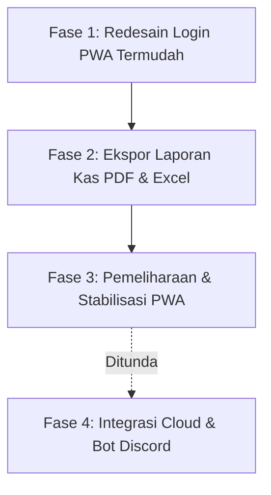

# 🚀 Future Plan & Roadmap Terfokus — ClassHub (XII PPLG 1)

Dokumen ini merangkum **rencana pengembangan terarah**, hasil evaluasi kebutuhan nyata kelas, serta **desain mendalam untuk sistem login siswa yang paling mudah dan nyaman** pada aplikasi PWA (Progressive Web App) ClassHub XII PPLG 1.

---

## 📊 1. Status Audit Proyek Terkini (Capaian v2.0)

Berikut adalah status modul dan fitur yang telah berhasil diimplementasikan pada proyek saat ini:

| Fitur / Modul | Status | Keterangan |
| :--- | :---: | :--- |
| **PWA (Progressive Web App)** | ✅ **Selesai** | Dikonfigurasi via `vite-plugin-pwa`, manifest offline, service worker, & prompt install di HP (`InstallBanner.jsx`). |
| **Generator Pesan WhatsApp (Smart Share)** | ✅ **Selesai** | Modal generator pesan WA (Daily Briefing, Weekly Digest, Kas) via `WhatsAppShareModal.jsx`. |
| **Live Class Tracker & Countdown** | ✅ **Selesai** | Pelacakan jam pelajaran aktif real-time, waktu sisa, & status jam istirahat (`LiveClassTracker.jsx`). |
| **Akademik & Tracking Tugas Per Siswa** | ✅ **Selesai** | Status Todo / Doing / Done per siswa dengan animasi selebrasi konfeti saat tugas selesai. |
| **Buku Kas & Matriks Iuran** | ✅ **Selesai** | Pembukuan pemasukan/pengeluaran, filter iuran pribadi, & matriks lunas per siswa. |
| **Notion-Style UI & Mobile Nav Dock** | ✅ **Selesai** | Antarmuka bersih bernuansa Notion, typography *Plus Jakarta Sans*, dan dock navigasi bawah untuk HP. |

---

## 🔑 2. Fokus Utama: Redesain Sistem Login Siswa yang Paling Mudah (PWA-Optimized)

### 🧐 Masalah pada Login Saat Ini
Pada versi saat ini, siswa harus:
1. Membuka dropdown panjang berisi seluruh siswa kelas.
2. Mencari namanya satu per satu.
3. Mengetikkan PIN `1234`.
4. Menekan tombol "Masuk Sekarang".

Karena aplikasi **ClassHub berjalan sebagai PWA di smartphone pribadi masing-masing siswa**, proses ini terasa kaku dan berulang jika harus dilakukan terus-menerus.

---

### 💡 Konsep & Mekanisme Login Termudah (Zero Friction)

Untuk membuat pengalaman login secepat kilat tanpa menghilangkan privasi akun masing-masing siswa, berikut rancangan arsitektur login baru:

```
┌────────────────────────────────────────────────────────┐
│                   ALUR LOGIN PWA TERMUDAH              │
├────────────────────────────────────────────────────────┤
│                                                        │
│  [Instalasi Pertama di HP Siswa]                       │
│     │                                                  │
│     ▼                                                  │
│  [Pilih Kartu Profil / Cari Nama Cepat]                │
│     │                                                  │
│     ▼                                                  │
│  [Input PIN 4 Digit — Auto Submit tanpa klik tombol]   │
│     │                                                  │
│     ▼                                                  │
│  [Toggle: "Ingat Perangkat Ini" AKTIF SECARA OTOMATIS] │
│     │                                                  │
│     ▼                                                  │
│  [Selesai! Sesi Login Tersimpan Permanen di HP]        │
│                                                        │
│  ────────────────────────────────────────────────────  │
│  [Setiap Kali Membuka Aplikasi PWA di Masa Depan]      │
│     │                                                  │
│     ▼                                                  │
│  ⚡ LANGSUNG MASUK KE DASHBOARD DALAM 0 DETIK!        │
│     (Tanpa layar login, tanpa ketik PIN lagi)          │
│                                                        │
└────────────────────────────────────────────────────────┘
```

### 🛠️ Rincian Fitur Login Siswa Termudah:

#### A. Sesi Permanen PWA (*Persistent Device Session / Auto-Login*)
- Begitu siswa berhasil login satu kali di HP mereka, token sesi disimpan di `localStorage` perangkat secara aman dan permanen.
- Ketika siswa membuka ikon ClassHub dari home screen HP (PWA mode), aplikasi **langsung melompat ke Dashboard** tanpa menampilkan layar login sama sekali.
- Siswa hanya perlu login **sekali saja seumur hidup** selama cache browser tidak dibersihkan manual.

#### B. Quick Visual Profile Picker (Bukan Dropdown Membosankan)
- Menggantikan elemen `<select>` dropdown standar dengan:
  - **Grid Kartu Avatar / Nomor Absen**: Siswa cukup mengetuk kartu foto/inisial namanya.
  - **Quick Search Instant Filter**: Kolom pencarian responsif. Mengetik 2 huruf (misal: `"Fa"`) langsung memfilter nama *"Fauzan"* secara instan.
  - **Daftar "Terakhir Masuk di Perangkat Ini"**: Jika siswa pernah login di HP tersebut, nama mereka langsung disematkan paling atas sebagai rekomendasi satu-klik.

#### C. Input PIN 4 Digit Auto-Advance
- Input 4 kotak kecil (`[ ][ ][ ][ ]`).
- Saat siswa mengetik angka ke-4, form **otomatis memvalidasi dan login seketika** (*auto-submit*) tanpa perlu menggeser layar dan menekan tombol *"Submit"*.
- Dilengkapi opsi *"Tampilkan / Sembunyikan PIN"*.

#### D. Opsi "Beralih Akun / Ganti Pengguna" yang Bersih
- Jika HP dipinjam teman sekelas untuk memeriksa tugasnya, siswa cukup menekan profil di pojok kanan atas -> *"Ganti Akun"*.
- Terdapat tombol *"Keluar dari Perangkat Ini"* yang jelas dan aman.

#### E. Pemisahan Tegas: Akun Siswa vs Akun Pengurus/Admin
- **Siswa Biasa**: Fokus pada kemudahan akses, centang tugas pribadi, dan cek jadwal.
- **Admin / Pengurus**: Memiliki toggle terpisah dengan proteksi PIN khusus (`admin123`) untuk mengedit jadwal, mencatat uang kas, dan mengumumkan pengumuman kelas.

---

### 🛡️ Mekanisme Keamanan Pasca-Deploy: Mencegah Siswa Saling Membajak / Login Akun Teman

Saat web di-deploy secara publik (misal di Vercel atau Netlify), penggunaan satu PIN default (`1234`) tentu berisiko menimbulkan keisengan teman sekelas (mencentang tugas orang lain atau mengacak data). 

Untuk mengatasi hal ini, berikut mekanisme keamanan yang akan diterapkan:

#### 1. Alur Aktivasi Mandiri Pertama Kali (*First-Time PIN Setup / Claim Account*)
- **Kondisi Awal (Fresh Deploy)**: Seluruh akun siswa berstatus `pin: null` atau `isActivated: false`.
- **Saat Siswa Membuka PWA di HP-nya Pertama Kali**:
  1. Siswa memilih namanya sendiri (misal: *Fauzan*).
  2. Sistem mendeteksi bahwa akun *Fauzan* belum diaktivasi.
  3. Muncul modal aktivasi:
     > *"Halo Fauzan! Ini perangkat barumu? Buat PIN 4-digit rahasiamu untuk mengamankan akun ini."*
  4. Siswa mengetikkan 4 digit PIN baru pilihannya sendiri + konfirmasi ulang.
  5. Akun statusnya berubah menjadi `isActivated: true` dengan PIN rahasia tersimpan aman.
- **Dampaknya**: 
  - HP siswa langsung menyimpan token sesi permanen (*Remember Me*), jadi pemilik asli **tidak perlu memasukkan PIN lagi** di kemudian hari.
  - Teman lain di HP berbeda **tidak akan bisa masuk** sebagai *Fauzan* karena tidak mengetahui PIN rahasia yang baru saja dibuat.

#### 2. Kredensial Fallback (Opsi Verifikasi NISN / Tanggal Lahir)
- Sebagai lapisan verifikasi awal saat aktivasi akun pertama kali (untuk memastikan yang mengklaim adalah siswa yang bersangkutan):
  - Sistem meminta verifikasi **4 Digit Terakhir NISN** atau **Tanggal Lahir (Format DDMM)** sebelum mengizinkan siswa membuat PIN baru.

#### 3. Fitur "Reset PIN oleh Admin / Pengurus" *(Proteksi Anti-Jahiliyah & Lupa PIN)*
- **Masalah yang Diantisipasi**:
  - Ada teman yang iseng mendaftarkan/mengklaim nama temannya lebih dulu sebelum pemilik aslinya membuka web.
  - Siswa lupa PIN 4-digit yang pernah dibuatnya.
- **Solusi**:
  - Admin/Pengurus Kelas (pemegang PIN Master `admin123` / Wali Kelas) memiliki tombol di menu Daftar Anggota: **"Reset PIN Siswa" 🔄**.
  - Begitu ditekan oleh Admin, PIN akun tersebut kembali kosong (`isActivated: false`), dan pemilik asli dapat membuat PIN baru dari HP-nya.

#### 4. Menu "Ubah PIN Saya" di Profil Siswa
- Di pojok kanan atas profil siswa, disediakan opsi mudah: **"Ganti PIN Saya"** (dengan memverifikasi PIN lama terlebih dahulu).

---

## 📑 3. Fitur Tambahan Prioritas: Ekspor Laporan Kas Resmi (PDF Siap Cetak & Excel)

### 💡 Konsep
Kebutuhan penting bagi Bendahara Kelas XII PPLG 1 untuk menyetorkan laporan pertanggungjawaban uang kas kepada Wali Kelas dan orang tua murid secara berkala.

### 🛠️ Spesifikasi:
1. **Format Cetak Standar Kertas A4**:
   - Kop resmi: Nama Sekolah, Jurusan PPLG, Kelas XII PPLG 1, dan Bulan Transaksi.
   - Tabel ringkasan keuangan: Total Pemasukan, Total Pengeluaran, dan Saldo Akhir saat ini.
   - Tabel rincian pengeluaran lengkap dengan tanggal, kategori, dan keterangan.
   - Matriks status kepatuhan bayar uang kas per siswa.
2. **Kolom Tanda Tangan Resmi**:
   - Kolom tanda tangan digital/cetak untuk:
     - **Ketua Kelas**
     - **Bendahara Kelas**
     - **Wali Kelas**
3. **Pilihan Format Unduhan**:
   - Tombol **"Cetak / Simpan PDF"** (menggunakan styling cetak browser `@media print` atau `html2pdf`).
   - Tombol **"Unduh Excel / CSV"** untuk arsip berkas bendahara.

---

## ⏳ 4. Fitur yang Ditunda (*On-Hold / Backlog*)

Fitur-fitur berikut diakui memiliki nilai tambah, namun **ditunda pelaksanaannya** untuk saat ini agar tim dapat berfokus pada kestabilan PWA dan kemudahan akses harian siswa:

### 4.1. Cloud Database Sync Real-time (Supabase / Firebase) — *DITUNDA*
- **Status**: Ditunda untuk saat ini.
- **Pertimbangan**: Saat ini penyimpanan lokal `localStorage` sudah mencukupi untuk operasional dasar. Migrasi backend cloud (Supabase PostgreSQL / Firestore) akan dipertimbangkan pada fase berikutnya jika seluruh data kas dan jadwal resmi sudah difinalisasi oleh pengurus kelas.

### 4.2. Bot Pengingat Tugas Otomatis (Discord / Telegram Webhook) — *DITUNDA*
- **Status**: Ditunda untuk saat ini.
- **Pertimbangan**: Fitur *Generator Ringkasan WhatsApp* yang sudah ada saat ini telah memenuhi 95% kebutuhan distribusi informasi harian di grup kelas. Bot otomatis akan disinkronkan setelah database cloud siap.

---

## 🚫 5. Daftar Fitur yang Dibatalkan (*Cancelled*)

Berdasarkan tinjauan kebutuhan nyata dan efisiensi aplikasi, ide-ide berikut **resmi dibatalkan** dan tidak akan dikembangkan:

| Ide yang Dibatalkan | Alasan Pembatalan |
| :--- | :--- |
| **Model Akses Terbuka (Guest Read-Only Tanpa Login)** | Dibatalkan karena aplikasi berbasis PWA yang dipasang di HP masing-masing siswa. Login tetap dipertahankan dengan solusi *Auto-Login / Persistent Session*. |
| **Showcase Portofolio Karya Siswa PPLG** | Dibatalkan agar portal tetap fokus sebagai alat manajemen operasional & utilitas kelas, bukan etalase web terpisah. |
| **Lab Snippet Hub & Git Cheatsheet PPLG** | Dibatalkan karena referensi koding sudah banyak tersedia di dokumentasi resmi, GitHub, dan catatan pelajaran masing-masing. |
| **Smart QR Attendance & Verifikasi Piket** | Dibatalkan karena operasional piket di kelas lebih praktis dipantau langsung oleh seksi kebersihan secara fisik. |
| **Soundboard & SFX Presentasi Kelas** | Dibatalkan karena berada di luar fungsi esensial portal kelas. |
| **Lo-Fi Coding Radio & Spotify Player** | Dibatalkan untuk menghemat kuota internet siswa dan menjaga performa ringan aplikasi PWA. |
| **Mini-Game Syntax Typer / Quiz** | Dibatalkan agar siswa fokus pada pencatatan tugas dan jadwal belajar. |
| **Memory Capsule & Buku Kenangan Digital** | Dibatalkan untuk menjaga kesederhanaan dan fokus fitur utama portal. |
| **Polling & Voting Kilat** | Dibatalkan karena pemungutan suara lebih efektif menggunakan polling bawaan WhatsApp grup kelas. |

---

## 🗓️ 6. Roadmap Pengerjaan Terfokus



### 📋 Tabel Rencana Pelaksanaan

| Tahap | Fitur / Rincian Pekerjaan | Estimasi | Prioritas |
| :--- | :--- | :---: | :---: |
| **Fase 1** | **Redesain Total Pengalaman Login Siswa**: <br>• Auto-login permanen pada perangkat PWA (*Remember Me*).<br>• Alur Aktivasi PIN mandiri pertama kali & proteksi anti-bajak akun.<br>• Visual card picker & filter pencarian nama siswa instan.<br>• Input PIN 4-digit auto-submit & tombol Reset PIN oleh Admin. | 1 - 2 Hari | 🔴 **Sangat Tinggi (Prioritas Utama)** |
| **Fase 2** | **Ekspor Laporan Kas (Cetak PDF & CSV)**: <br>• Template cetak A4 ber-kop surat resmi.<br>• Kolom ttd Ketua Kelas, Bendahara, Wali Kelas.<br>• Rekap transaksi bulanan & matriks pembayaran. | 2 - 3 Hari | 🟡 **Tinggi** |
| **Fase 3** | **Optimalisasi & Uji Coba PWA Siswa**: <br>• Verifikasi performa offline cache service worker.<br>• Uji coba kenyamanan input tugas di berbagai merk HP siswa. | 2 Hari | 🟢 **Sedang** |
| **Backlog** | **Cloud Database & Discord Webhook**: <br>• Sinkronisasi online multi-perangkat (Supabase/Firebase).<br>• Notifikasi bot Discord terjadwal. | Ditunda | ⚪ *Menunggu Kebutuhan Lanjutan* |

---

> 🎯 **Komitmen Pengembangan**:  
> ClassHub XII PPLG 1 berfokus pada **kemudahan akses instan bagi seluruh siswa**, **ketertiban manajemen tugas & kas**, serta performa aplikasi yang ringan dan andal di smartphone siswa.
