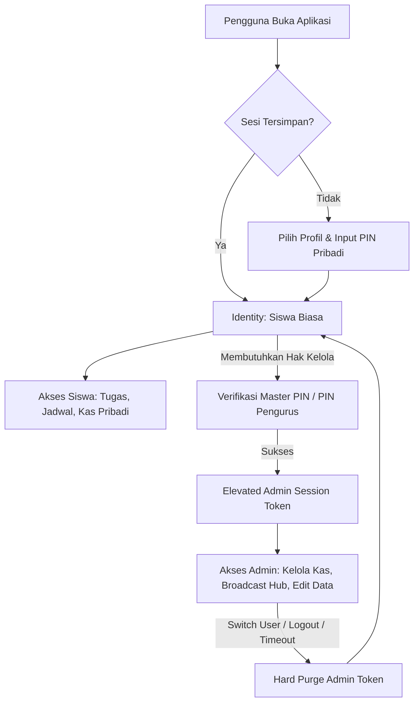
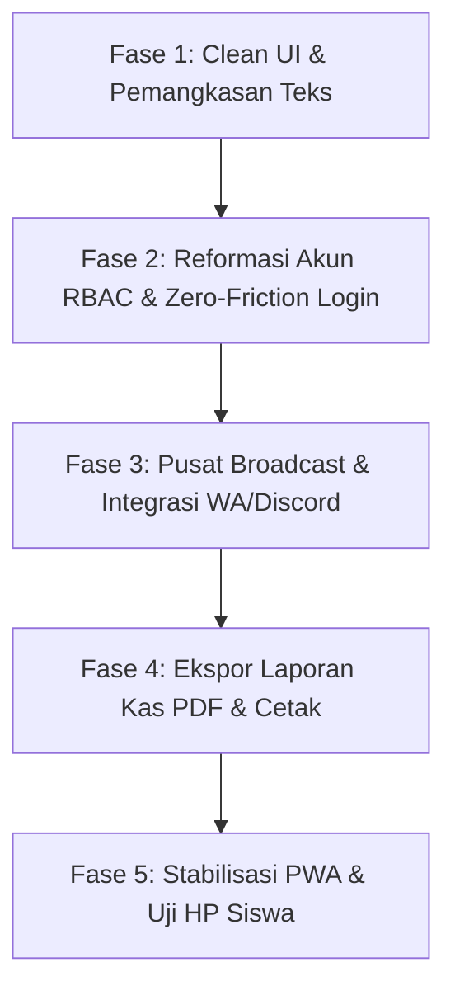

# 🚀 Future Plan & Roadmap Terfokus — ClassHub (XII PPLG 1)

Dokumen ini merangkum **rencana pengembangan terarah**, hasil analisis survei pengguna terkait **konsep Clean UI & pemangkasan teks berlebih**, serta **desain mendalam untuk sistem login siswa termudah** pada aplikasi PWA ClassHub XII PPLG 1.

---

## 📊 1. Status Audit Proyek Terkini (Capaian v2.0)

Berikut adalah status modul dan fitur yang telah berhasil diimplementasikan pada proyek saat ini:

| Fitur / Modul | Status | Keterangan |
| :--- | :---: | :--- |
| **PWA (Progressive Web App)** | ✅ **Selesai** | Dikonfigurasi via `vite-plugin-pwa`, manifest offline, service worker, & prompt install di HP (`InstallBanner.jsx`). |
| **Generator Pesan WhatsApp (Smart Share)** | ✅ **Selesai** | Modal generator pesan WA (Daily Briefing, Weekly Digest, Kas) via `WhatsAppShareModal.jsx`. |
| **Live Class Tracker & Countdown** | ✅ **Selesai** | Pelacakan jam pelajaran aktif real-time, waktu sisa, & status jam istirahat (`LiveClassTracker.jsx`). |
| **Akademik & Tracking Tugas Per Siswa** | ✅ **Selesai** | Status Todo / Doing / Done per siswa dengan animasi selebrasi konfeti saat tugas selesai. |
| **Buku Kas & Matriks Iuran** | ✅ **Selesai** | Pembukuan pemasukan/pengeluaran, filter iuran pribadi, & matriks lunas per siswa. |
| **Notion-Style UI & Mobile Nav Dock** | ✅ **Selesai** | Antarmuka bernuansa Notion, typography *Plus Jakarta Sans*, dan dock navigasi bawah untuk HP. |

---

## 🔍 2. Diagnosa Hasil Survei: Mengapa UI Terasa "Terlalu Rame" & Sulit Dipahami?

Berdasarkan survei langsung terhadap pengguna (siswa dan pengurus kelas), terdapat keluhan utama bahwa tampilan antarmuka terasa **penuh sesak (*cluttered*)**, **terlalu banyak teks yang tidak perlu dibaca**, serta **interaksi yang membingungkan**. 

Berikut identifikasi akar masalah (Root Cause Analysis):

```
                               MASALAH UTAMA SURVEY
                                        │
     ┌──────────────────┬───────────────┴───────────────┬──────────────────┐
     ▼                  ▼                               ▼                  ▼
[Over-Explanation] [Visual Noise / Pelangi Tag] [Cognitive Overload] [Ambiguous Flow]
  Banyak teks basa-    Hampir setiap baris ada     Semua info ditumpuk   Checkbox 3-status
  basi & petunjuk      badge warna-warni;          di 1 layar tanpa      membingungkan;
  yang tak perlu.      mata lelah & tanpa fokus.   prioritas hierarki.   tabel padat di HP.
```

### A. Teks Eksplanatori Berlebih (*Over-Explanation & Patronizing Copy*)
- **Instruksi yang Tidak Perlu**: Ada teks seperti *"Klik kotak centang untuk menandai tugas yang sudah kamu selesaikan."* Pengguna modern sudah memahami fungsi kotak centang; instruksi eksplisit seperti ini justru membuang ruang layar ponsel dan menambah beban baca.
- **Teks Paragraf Basa-Basi di Tracker**: Pada komponen pelacak kelas (*Live Tracker*), terdapat teks nasihat panjang seperti:
  > *"Gunakan waktu istirahat untuk makan siang, sholat, dan menyegarkan pikiran."*  
  > *"Siapkan perlengkapan belajar, cek tugas harian, dan pastikan sudah sarapan..."*  
  Siswa membuka portal kelas hanya butuh waktu **1–2 detik** untuk mengetahui: *"Sekarang pelajaran apa? Sisa berapa menit? Di ruang mana?"*. Teks motivasi panjang justru menjadi polusi visual.
- **Deskripsi Subheader Berulang**: Setiap halaman memiliki subjudul panjang di bawah judul utama yang jarang dibaca namun memakan 20% tinggi layar ponsel sebelum konten utama terlihat (*above-the-fold* terhalang).

### B. "Pelangi Tag" & Kebisingan Visual (*Visual Noise*)
- Dalam satu baris tugas atau baris properti, terdapat 3 sampai 4 badge dengan warna kontras berbeda (kuning, hijau, biru, oranye, ungu).
- Saat semua elemen berwarna mencolok, **tidak ada satu pun elemen yang menonjol**. Mata pengguna mengalami kelelahan visual (*visual fatigue*) karena tidak tahu ke mana harus mengarahkan pandangan pertama kali.

### C. Beban Kognitif di Layar Ponsel (*Viewport Crowding*)
- Pada *DashboardView*, pengguna langsung dihujani:
  1. Header halaman + icon + deskripsi panjang
  2. Banner Callout kuning 3 baris
  3. Baris properti status (4 kotak)
  4. Live Class Tracker besar dengan progress bar dan 3 meta item
  5. Daftar tugas harian + tombol WhatsApp + tombol Lihat Semua
  6. Tabel jadwal pelajaran hari ini
  7. Kartu pengumuman kelas terkini
- Ketiadaan ruang kosong (*whitespace*) yang memadai membuat pengguna merasa "terintimidasi" oleh tumpukan kotak dan garis pembatas.

### D. Ambiguitas Interaksi (*Unexpected Mechanics*)
- **Checkbox 3-Status**: Mengklik kotak centang tugas saat ini mengganti status secara berurutan: `todo` → `doing` → `done`. Pengguna terbiasa bahwa **centang = selesai, kosong = belum**. Pola 3 status pada 1 kotak centang membuat siswa bingung apakah tugasnya sudah tuntas atau belum.
- **Matriks Kas Raksasa di HP**: Menampilkan tabel iuran 36 siswa x 12 minggu langsung di layar ponsel yang sempit menimbulkan scroll horizontal ekstrem yang membingungkan.

---

## 🧼 3. Filosofi Desain "Clean UI": High Signal, Zero Fluff

Konsep **Clean UI** bukan sekadar membuat latar belakang menjadi putih kosong atau menghapus fitur, melainkan **meningkatkan Signal-to-Noise Ratio (Rasio Manfaat dibanding Kebisingan)**.

> 📐 **Prinsip Utama**: *"Jika suatu kata, warna, atau garis pembatas tidak membantu siswa mengambil keputusan dalam 3 detik, hilangkan atau sembunyikan."*

```
┌─────────────────────────────────────────────────────────────────────────┐
│                    FRAMEWORK CLEAN UI CLASSHUB                          │
├─────────────────────────────────────────────────────────────────────────┤
│                                                                         │
│  1. ATURAN 3 DETIK (Glanceable UI)                                      │
│     Siswa memahami status belajarnya seketika tanpa perlu membaca teks  │
│     lebih dari 5 kata.                                                  │
│                                                                         │
│  2. DIET TEKS EKSTREM (Zero Instructional Copy)                         │
│     Hapus semua kalimat panduan cara klik/pilih. Biarkan bentuk UI      │
│     (affordance) yang menjelaskan fungsinya sendiri.                    │
│                                                                         │
│  3. PROGRESSIVE DISCLOSURE (Ketahui Saat Butuh)                         │
│     Tampilkan hanya intinya di halaman utama (Judul & Deadline).        │
│     Detail panjang, link Drive, dan catatan guru masuk ke modal/drawer. │
│                                                                         │
│  4. MONOCHROMATIC RESTRAINT (Disiplin Warna)                            │
│     Gunakan palet netral (slate/gray). Warna cerah HANYA untuk kondisi  │
│     kritis: Merah (Deadline <24 Jam/Tunggakan), Hijau (Tuntas).         │
│                                                                         │
│  5. PERSONAL-FIRST VIEW (Utamakan Data Diri Siswa)                      │
│     Tampilkan "Tugas Saya" dan "Kas Saya" terlebih dahulu, bukan data   │
│     seluruh siswa kelas secara bertumpuk.                               │
│                                                                         │
└─────────────────────────────────────────────────────────────────────────┘
```

---

## 🎨 4. Rencana Perombakan UI per Halaman (Before vs. After)

### 4.1. Dashboard Utama (`DashboardView.jsx`)

| Komponen | Kondisi Sekarang (Rame & Berisik) | Solusi Clean UI Baru (Fokus & Bernapas) |
| :--- | :--- | :--- |
| **Greeting & Callout** | Paragraf panjang 3 baris: *"Selamat Pagi, Fauzan! Kamu memiliki 2 tugas yang belum selesai. Semangat belajarnya! Hari ini giliranmu piket..."* | **1 Baris Ringkas & Personal**: *"Halo, Fauzan 👋 • 2 tugas menanti • Piket hari ini"* |
| **Live Class Tracker** | Box besar dengan teks motivasi, 4 badge status, countdown detik, dan teks paragraf istirahat. | **Compact Hero Widget**: <br>• Label kecil: `"SEKARANG (08:30 - 10:00)"`<br>• Judul Besar: **Pemrograman Web**<br>• Subteks 1 baris: `Pak Budi • Lab Komputer 2 • Sisa 25 mnt`<br>• *Tanpa teks ceramah istirahat/weekend!* |
| **Daftar Tugas** | Ada teks penjelasan cara centang tugas, tombol WA, tombol Lihat Semua, badge abu-abu, tanggal tenggat panjang. | **Micro-Focus To-Do (Maks 3 item terdekat)**:<br>• Checkbox binary sederhana.<br>• Judul tugas + badge tenggat merah jika mendesak (`Besok, 23:59`).<br>• Link *"Lihat semua (5) →"* di bagian bawah. |
| **Jadwal Hari Ini** | Menampilkan tabel/kartu seluruh pelajaran hari ini yang memakan tempat. | Disatukan ke dalam tab ringkas atau hanya menampilkan **Pelajaran Berikutnya** (*Next Up*), bukan seluruh daftar jika sudah siang hari. |

---

### 4.2. Akademik & Tugas (`AcademicView.jsx`)

| Masalah UI Lama | Solusi Desain Baru |
| :--- | :--- |
| **Checkbox 3-Status** (`todo` → `doing` → `done`) membuat siswa ragu apakah tugas sudah selesai. | **Kembali ke Checkbox Standar (Binary)**: <br>• Klik 1x = Langsung Selesai (Coret & Hijau).<br>• Klik lagi = Batal Selesai.<br>• Opsi *"Sedang Dikerjakan"* hanya berupa filter tab terpisah untuk siswa yang membutuhkan, bukan tombol klik berulang. |
| **Deskripsi & Link Mengotori List**: Kartu tugas memuat teks deskripsi panjang dan tombol link yang membuat ukuran kartu tidak seragam. | **Accordion / Tap-to-Expand**: Kartu hanya menampilkan judul, mapel, dan deadline. Jika diketuk, kartu membuka deskripsi dan tautan pengumpulan secara mulus. |
| **Sub-Tab Berjejer Padat**: Tab *"Daftar Tugas"* dan *"Jadwal Ujian"* ditambah filter status dan filter mapel yang berantakan di layar HP. | **Pill Filter Horizontal Bersih**: Filter status disederhanakan menjadi 3 tombol chip minimalis: `Semua`, `Perlu Dikerjakan`, `Selesai`. |

---

### 4.3. Kas & Keuangan (`CashView.jsx`)

| Masalah UI Lama | Solusi Desain Baru |
| :--- | :--- |
| **Matriks Raksasa di Ponsel**: Siswa langsung disodori tabel spreadsheet puluhan nama dan kotak iuran yang sulit digeser di HP. | **Prinsip "Personal First"**: <br>1. **Kartu Status Saya (Paling Atas)**: Kotak bersih berukuran pas: `Status Iuran Anda: LUNAS s/d Pekan 12` atau `Tunggakan: Rp 20.000 (2 Pekan)`. Lengkap dengan tombol konfirmasi ke bendahara.<br>2. **Tab Kedua "Buku Kas Kelas"**: Rincian arus kas masuk/keluar.<br>3. **Matriks Seluruh Kelas**: Masuk ke sub-tab *"Seluruh Siswa"* dengan pencarian nama instan, bukan tabel telanjang. |
| **Baris Properti Keuangan Terlalu Padat**: Saldo, Pemasukan, Pengeluaran, dan Iuran Wajib berjejer 4 kotak dengan warna kontras. | **Card Ringkasan Finansial Modern**: Saldo utama ditampilkan besar elegan, rincian pemasukan/pengeluaran ditampilkan proporsional di bawahnya tanpa badge warna yang menusuk mata. |

---

### 4.4. Kaidah Reduksi Teks (Microcopy Clean Guidelines)

Daftar kata/kalimat yang **DILARANG** digunakan pada rilis berikutnya demi menjaga antarmuka tetap bersih:

| Teks Lama yang Dihapus | Alasan | Format Pengganti yang Bersih |
| :--- | :--- | :--- |
| *"Klik kotak centang untuk menandai tugas yang sudah kamu selesaikan."* | Menjelaskan hal yang sudah jelas (Redundan). | **Dihapus total**. Tidak perlu teks panduan. |
| *"Daftar tugas terstruktur & jadwal evaluasi ujian kelas XII PPLG 1"* | Deskripsi formal yang tidak memberi nilai aksi. | **Dihapus total** atau diganti ringkasan dinamis: `3 tugas aktif`. |
| *"Gunakan waktu istirahat untuk makan siang, sholat, dan menyegarkan pikiran."* | Teks basa-basi yang memperpanjang scroll HP. | Cukup status: `Istirahat • Masuk pukul 12:45`. |
| *"Papan warta pengumuman resmi & direktori siswa..."* | Subjudul klise pengisi ruang. | Cukup judul: `Pengumuman Kelas`. |
| *"Klik tombol di bawah ini untuk mengunduh laporan..."* | Gaya penulisan era web lama. | Tombol berlabel jelas: `Unduh Rekap (PDF)`. |

---

## 🔑 5. Fokus Sistem: Redesain Sistem Login Siswa yang Paling Mudah (PWA-Optimized)

### 🧐 Masalah pada Login Saat Ini
Pada versi saat ini, siswa harus membuka dropdown panjang berisi seluruh siswa kelas, mencari namanya satu per satu, mengetikkan PIN `1234`, lalu menekan tombol masuk. Pada PWA di smartphone pribadi, alur ini terasa usang dan tidak praktis.

### 💡 Konsep Login Zero-Friction (Cukup 1 Kali di HP Sendiri)

```
┌────────────────────────────────────────────────────────┐
│                   ALUR LOGIN PWA TERMUDAH              │
├────────────────────────────────────────────────────────┤
│                                                        │
│  [Instalasi Pertama di HP Siswa]                       │
│     │                                                  │
│     ▼                                                  │
│  [Pilih Kartu Profil / Cari Nama Cepat (Ketik 2 Huruf)]│
│     │                                                  │
│     ▼                                                  │
│  [Input PIN 4 Digit — Auto Submit tanpa klik tombol]   │
│     │                                                  │
│     ▼                                                  │
│  [Toggle: "Ingat Perangkat Ini" AKTIF SECARA OTOMATIS] │
│     │                                                  │
│     ▼                                                  │
│  [Selesai! Sesi Login Tersimpan Permanen di HP]        │
│                                                        │
│  ────────────────────────────────────────────────────  │
│  [Setiap Kali Membuka Aplikasi PWA di Masa Depan]      │
│     │                                                  │
│     ▼                                                  │
│  ⚡ LANGSUNG MASUK KE DASHBOARD DALAM 0 DETIK!        │
│     (Tanpa layar login, tanpa ketik PIN lagi)          │
│                                                        │
└────────────────────────────────────────────────────────┘
```

### 🛠️ Fitur Utama Login Baru:
1. **Sesi Permanen PWA (*Auto-Login*)**: Siswa hanya login satu kali saat pertama kali membuka web/PWA di HP. Kunjungan berikutnya langsung membuka dashboard.
2. **Instant Search Profile Picker**: Mengganti `<select>` jadul dengan kolom cari instan + grid avatar siswa.
3. **PIN 4-Digit Auto-Advance**: Mengetik digit ke-4 langsung memvalidasi tanpa perlu tombol "Submit".
4. **Alur Klaim PIN Mandiri (First-Time Setup)**: Siswa membuat PIN rahasia sendiri saat pertama kali mengklaim akun agar tidak dibajak teman sekelas.
5. **Reset PIN oleh Pengurus**: Tombol reset darurat jika siswa lupa PIN yang dibuatnya.

---

## 📑 6. Fitur Pendukung Prioritas: Ekspor Laporan Kas Resmi (PDF & Excel)

Kebutuhan bagi Bendahara Kelas untuk mencetak laporan pertanggungjawaban kas:
- **Format Cetak Standar Kertas A4**: Kop surat resmi sekolah/kelas, ringkasan saldo, rincian pengeluaran, dan matriks pembayaran siswa.
- **Kolom Tanda Tangan Resmi**: Kolom tanda tangan Ketua Kelas, Bendahara, dan Wali Kelas.
- **Pilihan Ekspor**: Tombol *"Cetak / Simpan PDF"* via `@media print` dan unduhan format CSV/Excel.

---

## 📡 7. Konsep Arsitektur: Pusat Broadcast & Integrasi (Admin Hub - WA & Bot Discord)

### A. Latar Belakang & Urgensi
Saat ini tombol "Rekap WA" masih tersebar di beberapa tempat (Dashboard & Akademik). Agar antarmuka siswa tetap berpegang teguh pada prinsip **Clean UI**, seluruh kebutuhan pengiriman pesan, pemformatan teks, dan integrasi bot disatukan ke dalam **satu halaman khusus admin**.

Siswa biasa tidak akan melihat halaman ini, sehingga tampilan publik tetap bersih tanpa distraksi teknis.

### B. Modul & Fitur yang Dipertimbangkan:
1. **WhatsApp Broadcast Center**:
   - **Template Builder**: Editor template teks dinamis menggunakan placeholder variabel, misalnya: `{hari_ini}`, `{tugas_mendesak}`, `{jadwal_besok}`, `{status_kas}`.
   - **Mode Pratinjau Monospace**: Pratinjau langsung tampilan teks dalam format pesan WhatsApp (bold `*...*`, italic `_..._`, monospace ````...````).
   - **Aksi 1-Klik**: Tombol *"Buka WhatsApp Langsung"* (`wa.me/?text=...`) dan tombol *"Salin Teks Bersih"*.

2. **Integrasi Bot / Webhook Discord**:
   - **Discord Webhook Connector**: Pengurus dapat memasukkan URL Webhook channel Discord kelas (misal: `#pengumuman-tugas` atau `#agenda-kelas`).
   - **Rich Embed Generator**: Mengirim format pesan Discord Embed yang cantik dan profesional:
     - Warna embed dinamis (Merah = Deadline H-1, Biru = Info Akademik, Hijau = Kas).
     - Menampilkan daftar tenggat tugas secara terstruktur.
     - Pilihan mention otomatis (`@everyone` atau role siswa).
   - **Tombol *"Uji Coba Webhook"***: Memastikan koneksi webhook berhasil sebelum pesan broadcast sesungguhnya dikirim.

3. **Otomatisasi & Log Riwayat**:
   - Riwayat pengiriman broadcast (waktu, jenis informasi yang dikirim, dan pengurus yang mengeksekusi).
   - Opsi penjadwalan berkala di masa depan jika backend serverless sudah aktif.

---

## 🔐 8. Reformasi Sistem Akun & RBAC (Pencegahan Kebocoran Hak Akses Admin)

### A. Diagnosa Masalah Saat Ini (*Privilege Leak*)
Pada arsitektur saat ini:
1. **Kebocoran Sesi (*Session Bleed*)**: Ketika seseorang masuk ke mode Master Admin lalu menggunakan fitur ganti akun (*Switch User*), status `isAdmin: true` atau `isMasterAdmin: true` tidak ter-reset secara total, sehingga akun siswa biasa yang dipilih setelahnya ikut mewarisi hak akses admin.
2. **Tercampurnya Identitas dan Otoritas**: Siswa tertentu (seperti Ketua Kelas & Bendahara) memiliki properti statis `role: 'admin'`, padahal ketika mereka menggunakan HP untuk mencatat tugas pribadi, mereka seharusnya berada pada mode siswa, bukan selalu memegang master key.

### B. Arsitektur Baru: Multi-Tier RBAC & Strict Session Isolation



### C. Pilar Perubahan yang Akan Diterapkan:

1. **Pemisahan Total: Identitas Siswa vs Token Sesi Admin**:
   - `auth_user_identity`: Menyimpan data profil siswa (nama, absen, tugas yang diselesaikan).
   - `auth_admin_session`: Token otorisasi admin sementara yang terpisah. Token ini memiliki masa kedaluwarsa (*auto-expire* saat browser ditutup atau saat pengguna berpindah akun).

2. **Hard Purge saat Beralih Akun (*Switch User*)**:
   - Setiap kali terjadi pergantian akun, fungsi switch wajib menjalankan **pembersihan mutlak** (`revokeAdminPrivilege()`).
   - Akun siswa yang baru dibuka **100% dipaksa** memulai sesi sebagai siswa standar (`isAdmin: false`), tanpa peduli akun apa yang digunakan sebelumnya.

3. **Hierarki Peran Terstruktur (Granular Roles)**:
   - **Siswa**: Hak akses dasar melihat informasi & menandai tugas pribadi.
   - **Bendahara Kelas**: Verifikasi PIN Keuangan untuk mengelola transaksi & iuran kas.
   - **Sekretaris Kelas**: Verifikasi PIN Akademik untuk menambah/mengedit jadwal dan tugas.
   - **Ketua Kelas & Wali Kelas (Master Admin)**: Verifikasi Master PIN untuk mengakses seluruh kontrol, termasuk Broadcast Hub dan Reset PIN Siswa.

4. **Tombol "Masuk / Keluar Mode Admin" yang Eksplisit**:
   - Pengurus yang login sebagai siswa tidak langsung melihat tombol edit. Terdapat tombol *"Buka Akses Pengurus"* di pojok atau menu pengaturan yang meminta PIN verifikasi.
   - Setelah selesai mengelola data, pengurus dapat mengklik *"Kunci Akses Pengurus"* untuk kembali ke tampilan bersih siswa biasa.

---

## ⏳ 9. Fitur yang Ditunda & Dibatalkan

### A. Fitur yang Ditunda (*Backlog*)
- **Cloud Database Sync (Supabase/Firebase)**: Ditunda hingga data kas dan jadwal resmi semester ini difinalisasi pengurus kelas. Saat ini `localStorage` sudah mencukupi dan sangat responsif.
- **Bot Pengingat Telegram Otomatis**: Ditunda; difokuskan terlebih dahulu pada Discord Webhook & WhatsApp generator di Broadcast Hub.

### B. Fitur yang Dibatalkan (*Cancelled demi Clean UI & Fokus*)
Agar antarmuka tetap bersih dan tidak bengkak (*bloatware*), fitur-fitur berikut **resmi dibatalkan**:
- ❌ **Guest Read-Only Tanpa Login**: Dibatalkan karena PWA dipasang di HP pribadi dengan fitur *Auto-Login*.
- ❌ **Portofolio Karya & Snippet Hub**: Dibatalkan agar portal tetap fokus sebagai alat utilitas kelas.
- ❌ **Lo-Fi Player, Soundboard & Mini-Games**: Dibatalkan untuk menghemat kuota internet dan menjaga performa ringan.
- ❌ **Buku Kenangan & Polling Kilat**: Dibatalkan karena polling lebih efektif dilakukan di grup WhatsApp.

---

## 🗓️ 10. Roadmap Pelaksanaan Terintegrasi



### 📋 Tabel Rencana Eksekusi

| Tahap | Fokus Utama | Rincian Pekerjaan | Estimasi | Prioritas |
| :--- | :--- | :--- | :---: | :---: |
| **Fase 1** | **Clean UI & Diet Teks (Selesai)** | • Pemangkasan seluruh teks instruksi redundan & teks motivasi di Live Tracker.<br>• Redesain Dashboard menjadi fokus bento (Glanceable UI).<br>• Kembalikan checkbox tugas ke binary (centang = tuntas).<br>• Kartu anggota bersih (tanpa piket/birokrasi).<br>• Hapus judul ganda per halaman & bersihkan halaman login. | Selesai | 🟢 **Tuntas** |
| **Fase 2** | **Reformasi Akun RBAC & Login Zero-Friction** | • Perbaikan *Privilege Leak*: Isolasi sesi admin & *hard purge* saat ganti akun.<br>• Pemisahan identitas profil vs token elevasi izin pengurus.<br>• Auto-login permanen PWA (*Remember Me*).<br>• PIN 4-digit auto-submit & alur aktivasi PIN mandiri. | 1 - 2 Hari | 🔴 **Sangat Tinggi** |
| **Fase 3** | **Pusat Broadcast Hub (WA & Discord Bot)** | • Halaman/tab khusus admin untuk manajemen pesan siaran.<br>• Template builder dinamis pratinjau format WhatsApp.<br>• Integrasi Webhook Discord dengan pratinjau Rich Embed tugas.<br>• Riwayat log pengiriman broadcast. | 1 Hari | 🟡 **Tinggi** |
| **Fase 4** | **Ekspor Laporan Kas** | • Desain template cetak A4 ber-kop resmi kelas.<br>• Kolom tanda tangan Ketua Kelas, Bendahara, & Wali Kelas.<br>• Generator PDF siap cetak dan ekspor CSV. | 1 Hari | 🟡 **Tinggi** |
| **Fase 5** | **Stabilisasi & Uji HP Siswa** | • Audit performa PWA di layar smartphone kecil.<br>• Uji coba kenyamanan navigasi satu tangan (*one-handed mobile use*). | 1 Hari | 🟢 **Sedang** |
| **Backlog** | **Cloud Backend** | • Sinkronisasi multi-device Supabase / Firebase. | Ditunda | ⚪ *Kebutuhan Lanjutan* |

---

> 🎯 **Komitmen Akhir Desain**:  
> ClassHub berpegang teguh pada prinsip **"Less is More"**. Antarmuka yang hebat bukanlah antarmuka dengan teks terbanyak atau hiasan terlengkap, melainkan antarmuka yang memungkinkan siswa **menemukan informasi dalam 2 detik dan kembali fokus belajar**.


